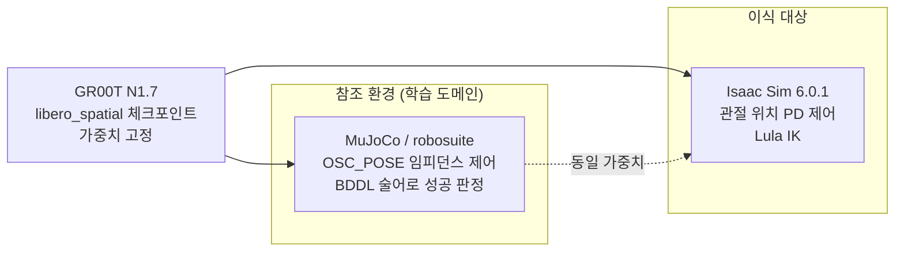
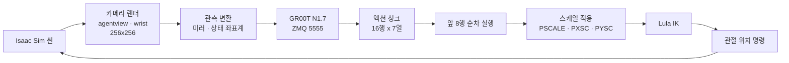
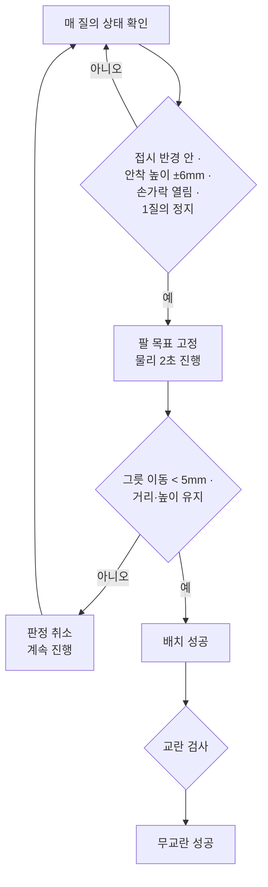
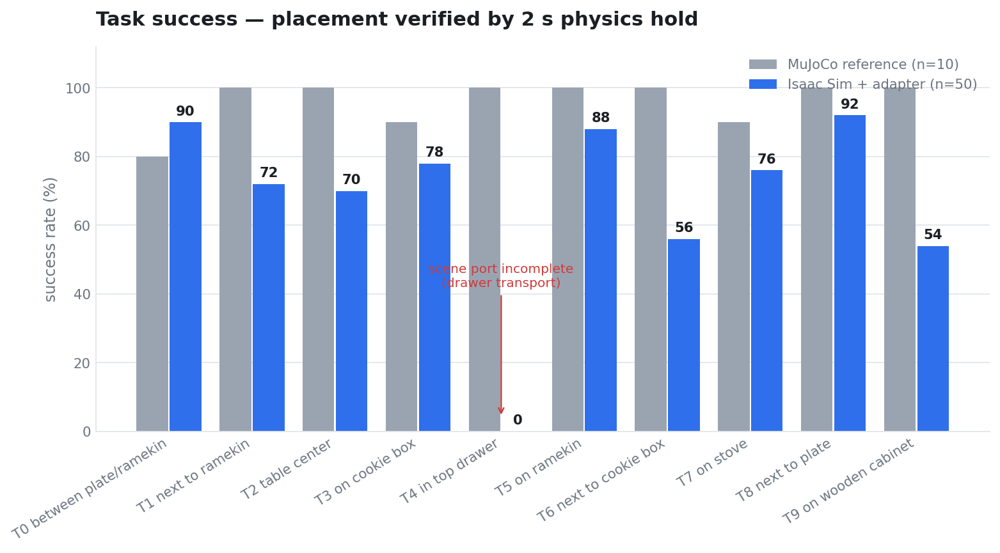

# LIBERO-Spatial Zero-Shot Transfer Benchmark

**GR00T N1.7 · NVIDIA Isaac Sim 6.0.1 · Franka Emika Panda**

MuJoCo에서 학습된 Vision-Language-Action 정책을 재학습 없이 Isaac Sim으로 옮겼다.
10개 조작 태스크 × 50회 = 500 에피소드 실측 기록이다.

[측정 방법](docs/methodology.md) ·
[어댑터 규약](docs/adapter.md) ·
[캘리브레이션](docs/calibration.md) ·
[성공 판정](docs/success_criteria.md) ·
[씬 충실도](docs/scene_fidelity.md) ·
[실패 분석](docs/failure_analysis.md) ·
[기각 기록](docs/rejected.md) ·
[English](en/README.md)

---

## 목차

| 절 | 내용 |
|---|---|
| [1. 한눈에 보기](#1-한눈에-보기) | 핵심 결과 요약 |
| [2. 문제 정의](#2-문제-정의) | 무엇을 옮기고 무엇을 옮기지 않았나 |
| [3. 파이프라인 구조](#3-파이프라인-구조) | 정책 ↔ 어댑터 ↔ 시뮬레이터 |
| [4. 어댑터 정합](#4-어댑터-정합) | 스케일을 어떻게 맞췄나 |
| [5. 성공 판정](#5-성공-판정) | 단계 정의와 문턱의 근거 |
| [6. 결과](#6-결과) | 태스크별 · 단계별 · 문턱별 |
| [7. 실패 분석](#7-실패-분석) | 어디서 무너지는가 |
| [8. 지시문 변형 실험](#8-지시문-변형-실험) | 프롬프트 정교화의 효과 |
| [9. 전체 측정값](#9-전체-측정값) | 원본 데이터 |
| [10. 측정 조건과 한계](#10-측정-조건과-한계) | 인용 전 확인 사항 |
| [11. 재현](#11-재현) | 실행 절차 |
| [12. 다음 측정 계획](#12-다음-측정-계획) | |

---

## 1. 한눈에 보기

### 핵심 수치

동일 가중치, 동일 지시문, 재학습 없음. 어댑터 계층만 조정했다.

| 단계 | MuJoCo 참조 (n=100) | Isaac Sim (n=500) |
|---|---|---|
| 그리퍼 폐쇄 | — | **98.2%** |
| 파지 성공 (들어올림) | — | **90.4%** |
| 접시 배치 (2초 물리 검증) | 96% | **67.6%** |
| 무교란 (다른 물체 · 접시 · 눌림 전부) | — | **4.8%** |

서랍 태스크(T4)는 씬 이식이 완결되지 않았다. 이를 제외하면 파지 95.6%, 배치 **75.1%** 다.


### 세 줄 요약

```
① 스케일이 참조의 절반이었다   — 폐루프 성능으로는 6개월 동안 못 찾았다
② 개루프 재생만이 재현 가능하다  — 참조 액션을 그대로 넣으면 정책 변수가 사라진다
③ 판정 문턱이 결과를 만든다     — 문턱 하나로 성공률이 24.6%에서 68.0%로 움직인다
```

### 이 저장소가 답하는 질문

| 질문 | 답 |
|---|---|
| 시뮬레이터를 바꾸면 VLA 정책이 왜 무너지는가 | 정책이 아니라 **행동 공간의 스케일·좌표계·주기 규약**이 어긋난다 |
| 그 규약을 어떻게 맞추는가 | 참조 시뮬레이터의 액션을 **개루프로 재생**해 궤적을 대조한다 |
| 남은 격차는 무엇인가 | **배치 정밀도** — 중앙값 27.6 mm, 참조 12.9 mm |

---

## 2. 문제 정의

### 2-1. 옮긴 것과 옮기지 않은 것



| 항목 | 참조 | 이식 대상 | 처리 |
|---|---|---|---|
| 정책 가중치 | GR00T N1.7 | 동일 | **변경 없음** |
| 지시문 | LIBERO 원문 | 동일 | **변경 없음** |
| 물리 엔진 | MuJoCo | PhysX | 이식 |
| 제어기 | OSC_POSE (임피던스) | 관절 위치 PD | **어댑터가 흡수** |
| 역기구학 | robosuite 내장 | Lula | 어댑터 |
| 관측 | robosuite 카메라 | Isaac RTX | 어댑터 |
| 성공 판정 | BDDL 술어 | 물리 검증 | 재구성 |

파인튜닝, 궤적 재생, 태스크별 오프셋은 사용하지 않았다. 어댑터가 하는 일은 **정책 출력을 다른 제어기의 언어로 번역**하는 것뿐이다.

### 2-2. 10개 태스크

전부 "검은 그릇을 집어 접시에 놓는다"이며, 그릇의 **공간적 위치**만 다르다.

| # | 지시문 (원문 유지) | 그릇 위치 | 참조 성공 |
|---|---|---|---|
| T0 | pick up the black bowl between the plate and the ramekin | 접시–라메킨 사이 | 8/10 |
| T1 | pick up the black bowl next to the ramekin | 라메킨 옆 | 10/10 |
| T2 | pick up the black bowl from table center | 테이블 중앙 | 10/10 |
| T3 | pick up the black bowl on the cookie box | 쿠키 상자 위 | 9/10 |
| T4 | pick up the black bowl in the top drawer of the wooden cabinet | 서랍 안 | 10/10 |
| T5 | pick up the black bowl on the ramekin | 라메킨 위 | 10/10 |
| T6 | pick up the black bowl next to the cookie box | 쿠키 상자 옆 | 10/10 |
| T7 | pick up the black bowl on the stove | 스토브 위 | 10/10 |
| T8 | pick up the black bowl next to the plate | 접시 옆 | 10/10 |
| T9 | pick up the black bowl on the wooden cabinet | 캐비닛 위 | 10/10 |

참조 성공률은 동일 정책을 MuJoCo에서 태스크당 10회 실행한 실측이다. 합계 96/100.

---

## 3. 파이프라인 구조



정책은 관측 한 번에 **16스텝짜리 궤적을 통째로 예측**한다. 어댑터는 앞 8행을 한 행씩 실행한 뒤 다시 질의한다. 참조의 `n_action_steps=8`과 같은 주기다.

| 계층 | 참조 | 이식 |
|---|---|---|
| 질의 주기 | 8 env-step | 8 substep (동일) |
| 액션 1행당 물리 | 20 × 0.002 s | 3 × 0.0167 s |
| 위치 명령 | OSC 목표 → 임피던스 | IK → 관절 위치 PD |
| 도달률 | 스텝 내 도달 | **33 ~ 50%** |

마지막 행이 이번 작업의 출발점이다. 관절 위치 PD는 한 제어 주기 안에 목표에 도달하지 못한다. 그 부족분을 스케일로 흡수해야 하는데, 그 값이 잘못 잡혀 있었다.

---

## 4. 어댑터 정합

### 4-1. 폐루프로는 값을 못 찾는다

성공률을 보고 파라미터를 바꾸는 방식으로는 `PSCALE`이 세 번 바뀌었고 매번 근거가 달랐다.

원인은 자기참조다. 실효 전달률은 `PSCALE × 도달률`인데, **도달률 자체가 `PSCALE`의 함수**다. 명령이 크면 팔이 정상 속도 구간에 들어가 도달률이 올라간다. 폐루프에서는 여기에 정책 분산과 관측 오차까지 겹친다.

### 4-2. 개루프 재생

참조가 MuJoCo에서 낸 액션을 NPZ로 기록해 **정책을 부르지 않고** 어댑터에 그대로 투입했다. 정책·관측이 빠지므로 남는 것은 어댑터 변환뿐이다.


첫 질의(q0 → q1)만 사용했다. 그 이후는 궤적이 벌어져 자코비안이 달라지므로 값이 오염된다.


| PSCALE | 이동비 (우리/참조) | 에피소드 4개 산포 |
|---|---|---|
| 0.016 (기존) | 0.66 | — |
| 0.020 | 0.806 | ±0.010 |
| 0.024 | 0.979 | ±0.014 |
| 0.028 | 1.151 | ±0.018 |
| 0.031 | 1.279 | ±0.020 |

**이동비 1.00은 0.0245다.** 4개 에피소드에서 소수점 셋째 자리까지 일치했다. 기존 값 0.016은 참조 움직임의 66%만 실현하고 있었다.

### 4-3. 축별 잔차

전체 스케일을 맞춘 뒤에도 축마다 오차가 남았다. Franka의 관절 배치와 중력 방향 때문이다 — y는 베이스 요 관절이 주도하고 x·z는 어깨·팔꿈치가 주도하며, 최대 토크가 87/87/87/87/12/12/12 N·m로 다르다.

| 축 | 보정 전 이동비 | 보정값 | 보정 후 |
|---|---|---|---|
| x | 1.10 | `PXSC = 0.91` | 0.99 |
| y | 0.87 | `PYSC = 1.18` | 1.03 |
| z | 1.41 | `ZFF = 0.0003` | 0.99 |

`ZFF`는 중력 처짐 보정이다. 스케일이 맞기 전에는 0.0029가 필요했으나, 정합 후에는 **10분의 1**로 줄었다. 처짐의 상당 부분이 사실은 스케일 부족이었다.

### 4-4. 관측 규약

참조의 이미지 전처리를 코드 수준에서 대조하고, 정책에 직접 질의해 검증했다. 동일 상태·동일 지시문으로 이미지만 바꿔 액션 거리를 측정했다.

| 조건 | 참조 액션과의 거리 | 판정 |
|---|---|---|
| 참조 이미지 (기준선) | 0.064 | — |
| 우리 렌더 (정합 후) | **0.063** | 잡음 대역 안 |
| 손목 카메라를 3인칭 복제로 대체 | **0.714** | 11배 |

손목 카메라를 위조하면 액션이 특정 방향으로 강하게 편향된다. 그 편향이 우연히 목표 방향과 겹치면 **성능이 좋아 보이는 인공물**이 생긴다. 이 저장소의 초기 측정이 그 함정에 빠져 있었고, 위 프로브가 그것을 걷어냈다.

확정된 관측 규약은 [docs/adapter.md](docs/adapter.md)에 전량 기록했다.

---

## 5. 성공 판정

### 5-1. 왜 판정을 새로 만들어야 했나

참조 환경은 BDDL 술어가 성립하는 순간 에피소드를 종료한다. 그래서 **학습 데이터에 "놓은 뒤" 구간이 한 프레임도 없다.** 참조 에피소드 길이는 74~138 env-step, 질의로 10~17회다.

정책에는 보상도 종료 신호도 성공 예측도 들어가지 않는다. 놓은 뒤의 상태는 정책이 본 적 없는 관측이고, 실제로 다시 집으려는 행동이 나온다(500판 중 186판).

종료 판단은 환경의 몫이다. 참조는 술어로, 이 저장소는 물리 검증으로 한다.

### 5-2. 판정 절차



**물리 검증이 핵심이다.** 판정이 걸리면 팔을 그 자리에 고정하고 2초 동안 물리만 진행시킨다. 그릇이 제대로 얹혔으면 그대로 있고, 매달려 있었거나 기울어 있었으면 떨어진다. 500판 중 32판이 이 단계에서 탈락했다.

### 5-3. 문턱의 근거

임의로 정한 값을 결과에 맞춰 조정하지 않기 위해, 문턱은 **물리 측정 또는 참조 실측**에서 유도했다.

| 문턱 | 값 | 유도 방법 |
|---|---|---|
| 안착 높이 | 접시 원점 + 13.0 mm | 그릇을 접시 위 100 mm에서 낙하 → 정착 위치 실측. 4개 태스크 동일 |
| 배치 반경 | 50 mm | 오프셋을 0~60 mm로 바꿔가며 낙하 → 기울기 1° 미만으로 안착하는 한계 |
| 접시 이동 | 5 mm | 참조 실측 0.2 mm + 물리 잡음 마진 |
| 무관 물체 이동 | 5 mm | 참조 실측 0.0 mm + 마진 |
| 그릇 침하 | 3 mm | 참조 실측 0.0 mm + 마진 |
| 충격 횟수 | 12 | 참조 실측 10회 |

물체는 리셋 직후 낙하·정착하므로, 기준 좌표는 **60 스텝 정착 후**에 읽는다. 이 처리가 없으면 로봇이 건드리지 않아도 접시가 4.3 mm 움직인 것으로 기록된다.

### 5-4. 문턱 민감도

배치 반경 하나로 성공률이 크게 움직인다. 이 저장소는 값을 고르지 않고 **곡선 전체를 보고한다.**


| 배치 반경 | 성공 | 비율 |
|---|---|---|
| < 13 mm (참조 정밀도) | 66 / 500 | 13.2% |
| < 20 mm | 123 / 500 | 24.6% |
| < 30 mm | 191 / 500 | 38.2% |
| < 50 mm (물리 한계) | 340 / 500 | 68.0% |

---

## 6. 결과

### 6-1. 태스크별



| # | n | 폐쇄 | 파지 | 배치 | 무교란 | <13mm | <20mm | <30mm | <50mm | 참조 | 질의 |
|---|---|---|---|---|---|---|---|---|---|---|---|
| T0 | 50 | 50 | 50 | **45** | 10 | 20 | 34 | 42 | 46 | 8/10 | 18 |
| T1 | 50 | 46 | 49 | 36 | 2 | 9 | 18 | 28 | 36 | 10/10 | 39 |
| T2 | 50 | 50 | 50 | 35 | 2 | 0 | 0 | 2 | 34 | 10/10 | 30 |
| T3 | 50 | 50 | 49 | 39 | 4 | 8 | 14 | 23 | 40 | 9/10 | 31 |
| T4 | 50 | 45 | 22 | **0** | 0 | 0 | 0 | 0 | 0 | 10/10 | 350 |
| T5 | 50 | 50 | 50 | 44 | 3 | 13 | 28 | 35 | 44 | 10/10 | 28 |
| T6 | 50 | 50 | 41 | 28 | 0 | 0 | 0 | 5 | 27 | 10/10 | 96 |
| T7 | 50 | 50 | 49 | 38 | 1 | 9 | 15 | 25 | 39 | 9/10 | 31 |
| T8 | 50 | 50 | 50 | **46** | 2 | 4 | 9 | 24 | 46 | 10/10 | 28 |
| T9 | 50 | 50 | 42 | 27 | 0 | 3 | 5 | 7 | 28 | 10/10 | 106 |
| **합계** | **500** | **491** | **452** | **338** | **24** | 66 | 123 | 191 | 340 | 96/100 | — |
| | | 98.2% | 90.4% | 67.6% | 4.8% | 13.2% | 24.6% | 38.2% | 68.0% | 96% | |

`질의` 열은 에피소드 길이 중앙값이다. 참조는 10~17회로 끝나며, 우리 쪽 값이 클수록 재시도가 많다는 뜻이다.

### 6-2. 단계별 통과율


파지까지는 대부분의 태스크가 90% 이상이다. 격차는 이송·배치에서 벌어진다.

### 6-3. 배치 정밀도


| | 중앙값 | 분포 |
|---|---|---|
| 참조 (MuJoCo) | 12.9 mm | — |
| 이식 (Isaac Sim) | **27.6 mm** | 넓게 퍼짐 |

이 2배 차이가 **무교란 성공률을 결정한다.** 정밀도가 낮으면 그릇이 접시를 밀고, 그러면 교란 기준에서 탈락한다.

---

## 7. 실패 분석

### 7-1. 무교란 기준 실패 사유


| 사유 | 발생 | 내용 |
|---|---|---|
| 접시 밀림 | 90 | 그릇을 놓으면서 접시를 5 mm 넘게 밈 |
| 무관 물체 이동 | 43 | 라메킨·쿠키 상자·방해 그릇 |
| 그릇 눌림 | 19 | 그리퍼가 그릇을 3 mm 넘게 누름 |

**접시 밀림이 지배적이다.** 정밀도 부족이 그대로 교란으로 나타난다. 참조는 12.9 mm에 정확히 놓고 접시를 0.2 mm만 움직인다.

### 7-2. 태스크별 실패 유형

| 태스크 | 유형 | 근거 |
|---|---|---|
| T4 서랍 | **이송 실패** | 22/50이 그릇을 꺼내지만 접시 도달 0. 최종 거리 중앙 458 mm |
| T6 쿠키 상자 옆 | **들어올리기 실패** | 파지 41/50, 배치 28/50. 회전 클램프 포화 519~1122회 (성공 판 132~251) |
| T9 캐비닛 위 | **들어올리기 실패** | 파지 42/50. 접근 방위각이 다른 태스크와 크게 다름 |
| T2 테이블 중앙 | **정밀도** | 파지 50/50인데 <30 mm가 2판. 그릇을 접시 가장자리에 놓음 |

### 7-3. 놓은 뒤의 거동

| 항목 | 값 |
|---|---|
| 배치 성공 | 338 |
| 그리퍼가 물러남 | 46 |
| 놓은 뒤 다시 집음 | 186판에서 발생 |
| 물리 검증 탈락 | 32 |

학습 데이터에 "놓은 뒤" 구간이 없으므로 이 국면의 행동은 분포 밖이다. 재파지는 정책 결함이 아니라 **에피소드를 끝내지 않은 결과**다.

---

## 8. 지시문 변형 실험

공간 관계를 명시하고 목표 유지·안전 이탈·안정 완료를 추가한 지시문을 준비해 4개 태스크에서 대조했다.

**예시 (T3)**

```
원문   pick up the black bowl on the cookie box and place it on the plate

변형   Locate the black bowl resting on top of the cookie box.
       Pick up that same bowl, lift it clear of the box,
       and place it fully on the plate.
```

| 태스크 | 원문 배치 | 변형 배치 | 원문 무교란 | 변형 무교란 |
|---|---|---|---|---|
| T0 | 8/12 | 7/12 | 3 | 1 |
| T3 | 6/12 | 2/12 | 1 | 0 |
| T6 | 1/12 | 1/12 | 0 | 0 |
| T9 | 5/12 | 2/12 | 0 | 0 |
| 합계 | **20/48** | **12/48** | 4 | 1 |

**4개 태스크 전부에서 나빠졌다.** 들어올리기를 명시적으로 지시한 T3·T9에서 하락 폭이 가장 컸고, 들어올린 높이 중앙값도 오히려 줄었다(0.062 → 0.047).

지시문이 정책에 정상 전달된 것은 로그로 확인했다. 전달 실패가 아니라 **문장이 길어지면서 조건화가 흐려진 것**으로 보인다. LIBERO 학습 지시문은 전부 한 문장이며, 정책의 언어 임베딩은 그 분포에서 나왔다.

본 벤치마크는 원문 지시문으로 측정했다.

---

## 9. 전체 측정값

| 문서 | 내용 |
|---|---|
| [data/episodes.csv](data/episodes.csv) | 500 에피소드, 에피소드당 1행, 41개 필드 |
| [results/isaac_groot.md](results/isaac_groot.md) | 태스크별 집계와 분포 |
| [results/reference_mujoco.md](results/reference_mujoco.md) | MuJoCo 참조 원본 |
| [results/calibration_raw.md](results/calibration_raw.md) | 개루프 측정 원본 |
| [results/prompt_ab.md](results/prompt_ab.md) | 지시문 변형 원본 |

`episodes.csv` 주요 필드:

| 필드 | 의미 |
|---|---|
| `close_q`, `d_x`, `d_y`, `tip_rim` | 파지 시점 질의 번호와 그리퍼–그릇 상대 위치 |
| `maxlift`, `slip` | 최대 상승량, 파지 후 그릇 미끄러짐 |
| `holdd`, `holdz`, `hold_drift` | 물리 검증 후 거리 · 높이 · 이동량 |
| `pmax`, `distmax`, `distobj`, `bpen`, `bimp` | 교란 지표 |
| `termhold`, `strict`, `strict_why` | 배치 성공, 무교란 성공, 실패 사유 |
| `retq`, `lost_n`, `reject_n` | 후퇴 질의, 재파지 횟수, 물리 검증 탈락 |

---

## 10. 측정 조건과 한계

| # | 항목 | 내용 |
|---|---|---|
| 1 | **씬이 LIBERO 원본 초기 상태가 아니다** | 물체 좌표가 설정 파일의 영역 앵커에서 생성되었으며, 해당 파일에 그 사실이 주석으로 기재되어 있다. 참조와 10~90 mm 차이가 난다 |
| 2 | **T4 서랍 앵커 미동기화** | 서랍이 열려도 그릇 좌표가 따라가지 않아 그릇이 캐비닛 몸체 안에 남았다. 서랍의 실측 이동량(회전 25° 반영, 68/145 mm)을 적용해 수정했으나 z가 88 mm 남는다 |
| 3 | **방해 그릇이 씬에서 제외됨** | 참조 씬에는 검은 그릇이 2개이고 지시문은 그중 하나를 지목한다. 이식 씬은 1개뿐이라 **목표 선택 단계(S1)를 측정할 수 없다** |
| 4 | **회전 스케일 미검증** | `RSCALE` · `RMAX`는 개루프 정합을 하지 못했다. 축각 표현이 roll ≈ π 부근에서 퇴화해 지표가 성립하지 않는다 |
| 5 | **그리퍼 미정합** | 손가락 거동이 접촉 의존이라 개루프 재생으로 측정할 수 없다. 참조는 2~8 mm에서 멈추고 이식은 0 mm까지 조인다 |
| 6 | **양측 접촉 미계측 (S4)** | 접촉 센서를 구성하지 못해 두 손가락이 실제로 닿았는지 확인할 수 없다. 파지 여부는 들어올림으로 대체 판정했다 |
| 7 | **참조에 없는 장치를 도입했다** | 청크 단위 그리퍼 이진화, 성공 시 종료, 물리 검증, 후퇴 대기, 축별 스케일. 전부 [docs/adapter.md](docs/adapter.md)에 명시했다 |
| 8 | **판정 문턱 일부가 설계 선택이다** | 안착 높이 허용치 6 mm, 개방 판정 8 mm, 정지 판정 1질의, 물리 검증 5질의. 물리 유도가 아닌 값이다 |
| 9 | **영상이 질의당 1프레임이다** | 실시간의 약 1/24 밀도다. 육안 관찰이 실제보다 격하게 보인다 |
| 10 | **정책 출력의 확률성** | 플로우 기반이라 같은 관측에도 액션이 조금씩 다르다. 동일 관측 반복 질의의 착지 산포는 1.8~2.8 mm로, 관측된 태스크 간 차이보다 작다 |

---

## 11. 재현

### 11-1. 환경

| 항목 | 값 |
|---|---|
| 시뮬레이터 | NVIDIA Isaac Sim 6.0.1 |
| 로봇 | Franka Emika Panda, 관절 위치 PD (kp 22918, kd 4583) |
| IK | Lula, 폴백 4단계 |
| 정책 | GR00T N1.7, `libero_spatial` 체크포인트, embodiment tag `libero_sim` |
| 관측 | agentview 256×256 fovy 45° · wrist 256×256 fov 75° |
| 참조 | MuJoCo / robosuite, OSC_POSE, `n_action_steps = 8` |

### 11-2. 확정 파라미터

```
# 스케일 — 개루프 NPZ 재생으로 유도
PSCALE=0.0245  PXSC=0.91  PYSC=1.18  ZFF=0.0003  ZFFALL=1

# 관측 — 참조 이미지 대조 및 정책 프로브로 검증
FLIP=n  WRIST=real  WFLIP=h  WROLL=180  WFOV=75  WX=0.05  WRY=-90

# 상태 — 참조 실측
GINIT=0.0208  GSIGN=1  QROT=z180  EEFRAME=right_gripper

# 제어 주기 — 참조와 동일
SUBSTEP=3  NSUB=8  KSAMP=1

# 회전 — 미검증, 기존 값 승계
RSCALE=0.5  RMAX=0.5  RBASE=acc

# 그리퍼 — 설계 선택
GCHUNK=1  NOREOPEN=0  GOPEN=0.04  GCLOSE=0.0

# 판정 — 물리 측정 및 참조 실측
PSEAT=0.0130  REFR=0.050  SETTLEQ=60  REFZTOL=0.006
MAXPMOVE=0.005  MAXDIST=0.005  MAXBPEN=0.003  MAXBIMP=12
TERMREF=1  TERMHOLD=1  HOLDQ=5  RETWAIT=10  REFSTILL=1  REFOPEN=0.008
```

전체 실행 절차는 [docs/methodology.md](docs/methodology.md)에 있다.

### 11-3. 그림 재생성

```bash
python3 scripts/plot.py --csv data/episodes.csv --out assets
```

matplotlib 외에 의존성이 없다.

---

## 12. 다음 측정 계획

- [ ] 방해 그릇을 참조 좌표로 복원하고 목표 선택 단계(S1)를 측정
- [ ] 손가락 접촉 센서를 구성해 양측 접촉(S4) 계측
- [ ] 회전 스케일의 개루프 정합 — 쿼터니언 각도 기반 지표로 재작성
- [ ] T4 서랍 이송 실패 원인 규명
- [ ] 3인칭 카메라 단독 조건 측정 (손목 카메라 기여도 분리)
- [ ] 지시문 변형의 태스크 전체 측정
- [ ] 배치 정밀도 개선 — 참조 12.9 mm 대비 27.6 mm

---

## 저장소 구성

```
README.md                    본 문서
en/README.md                 English version

docs/
  methodology.md             실행 절차 · 조건 전량
  adapter.md                 관측 · 상태 · 스케일 · 주기 규약
  calibration.md             개루프 정합 절차와 측정 원본
  success_criteria.md        단계 정의 · 문턱의 물리적 근거
  scene_fidelity.md          이식 씬과 참조 씬의 좌표 대조
  failure_analysis.md        실패 유형 분해
  rejected.md                기각한 가설과 그 근거

results/
  isaac_groot.md             500 에피소드 집계
  reference_mujoco.md        MuJoCo 참조 원본
  calibration_raw.md         개루프 측정 원본
  prompt_ab.md               지시문 변형 원본

data/
  episodes.csv               에피소드별 1행

scripts/
  plot.py                    그림 생성

assets/                      차트
media/                       영상
```
