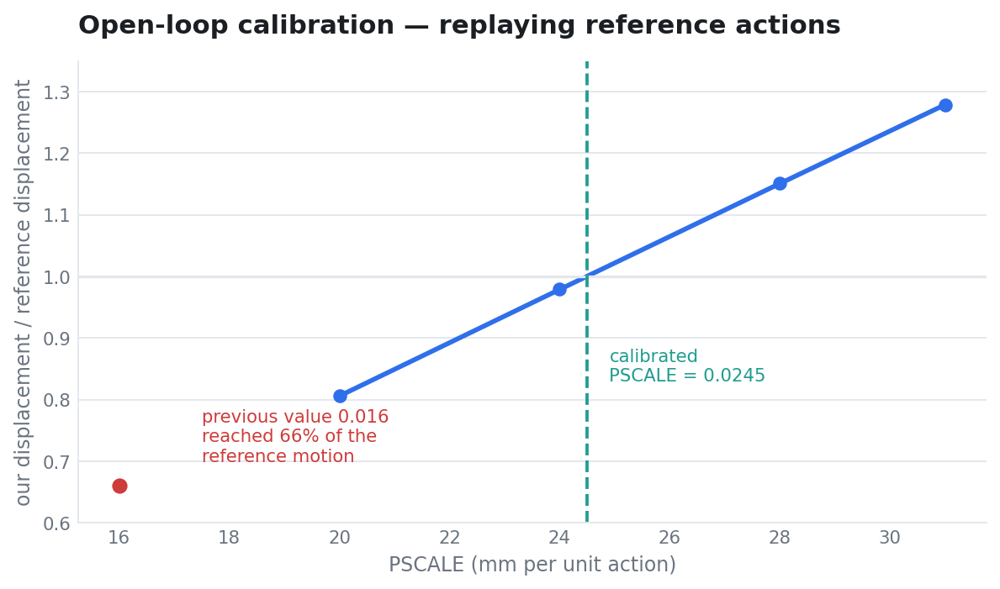
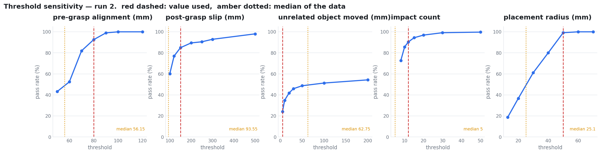
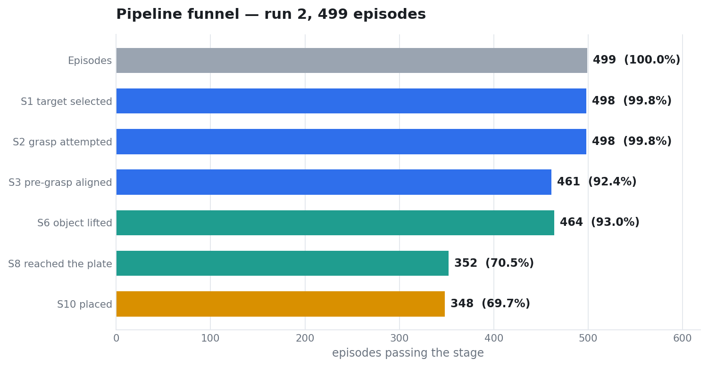
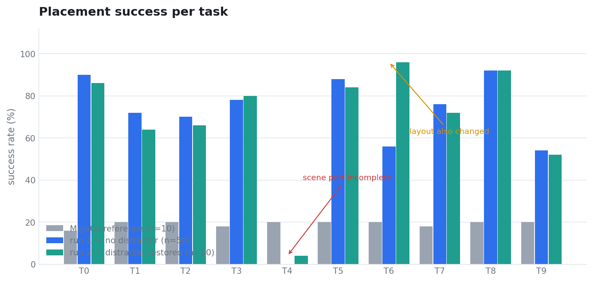
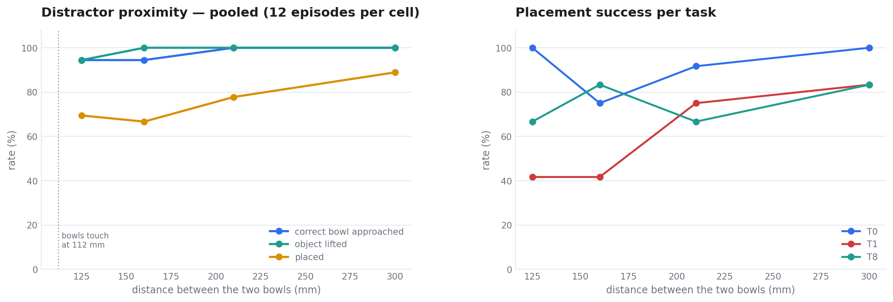
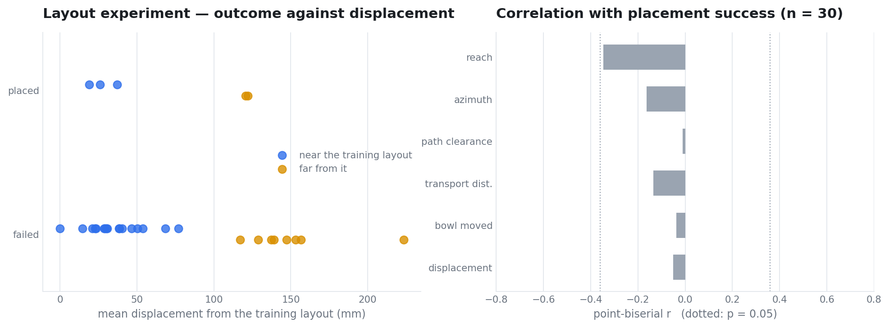
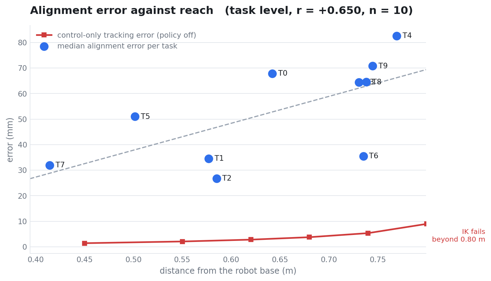
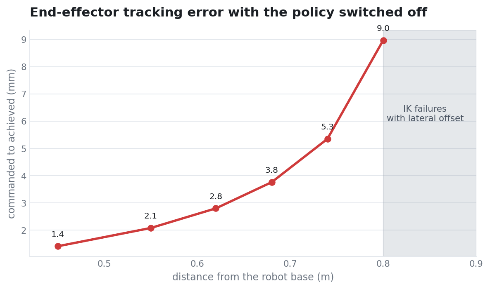

# GR00T N1.7 × Isaac Sim — LIBERO-Spatial 제로샷 이식과 실패 원인 실험

MuJoCo에서 학습된 GR00T N1.7을 Isaac Sim 6.0.1의 Franka Emika Panda로 옮겨
LIBERO-Spatial 10개 태스크를 실행했다. **GR00T의 가중치는 학습시키지 않았다(제로샷).**
어댑터 계층만 조정했고, 참조 궤적 재생이나 태스크별 위치 오프셋은 쓰지 않았다.

| | 측정 결과 |
|---|---|
| **행동 공간 규약이 맞으면 제로샷 이식이 된다** | MuJoCo 참조 96/100 (96 %) 대비 Isaac Sim 348/499 (69.7 %). 스케일 정합 전에는 태스크 성공 0판 |
| **정합은 폐루프 성능으로 할 수 없다** | 실효 전달률이 스케일과 도달률의 곱인데 도달률이 스케일의 함수라 역산이 수렴하지 않는다. 참조 액션을 개루프로 재생하면 에피소드 4개가 소수점 셋째 자리까지 일치한다 |
| **같은 종류의 방해 물체는 성능을 떨어뜨리지 않는다** | 복원 전 310/450, 복원 후 300/449. 차이 −2.1 %p, 95 % CI [−8.1, +4.0], Fisher p = 0.52. 목표 물체 선택은 498/499 |
| **물체 배치를 흔들면 무너진다** | 원배치 348/499 (69.7 %) → 무작위 배치 5/30 (17 %). 차이 −53 %p, 95 % CI [−63, −36], Fisher p = 8.7 × 10⁻⁹ |
| **무엇이 어려운지는 아직 모른다** | 기하학적 난이도와 학습 배치 거리 두 축 모두 성공을 예측하지 못했다. 쉬움 3/20 대 변이 2/10, 두 실험 모두 Fisher p = 1.00 |

네 번째와 다섯 번째가 이 저장소의 주된 결과이며, 다섯 번째는 음성 결과다.

[측정 방법](docs/methodology.md) ·
[어댑터 규약](docs/adapter.md) ·
[캘리브레이션](docs/calibration.md) ·
[성공 판정](docs/success_criteria.md) ·
[씬 충실도](docs/scene_fidelity.md) ·
[방해 물체](docs/distractor.md) ·
[배치 변화](docs/layout.md) ·
[작업공간](docs/workspace.md) ·
[기각 기록](docs/rejected.md)

---

## 정확히 하기 위해 밝혀두는 것

- **씬이 LIBERO 원본 초기 상태가 아니다.** 물체 좌표가 설정 파일의 영역 앵커에서
  생성된 값이며, 해당 파일에 그 사실이 주석으로 기재돼 있다. 참조와 10~20 mm 다르고
  목표 → 접시 이송 거리가 참조 137 mm 대비 110 mm로 20 % 짧다.
- **방해 물체 근접 실험의 12개 조건 중 8개에서 방해 물체가 카메라 화면 밖이었다.**
  배치를 정할 때 장애물 회피만 검사하고 가시 범위를 넣지 않았다. 보이지 않는 물체는
  인식을 방해할 수 없으므로 **인식 차원의 방해 효과는 측정되지 않았다.** 측정된 것은
  물리적 충돌 효과다.
- **T6은 방해 물체 외에 배치와 물체 방향도 바꿨다.** 방해 물체 효과의 단독 비교에서
  제외해야 한다. 이 태스크만 28/50 → 48/50으로 바뀌었다.
- **작업공간 의존은 사후에 발견한 관측이다.** 거리를 통제한 실험이 아니다.
- **배치 실험은 세트당 1판이다.** 성공이 5건뿐이라 인자 분석의 통계력이 없다.
- **양측 접촉, 회전 오차, 하강 기울기는 측정하지 못했다.** 파지 여부는 들어올림으로,
  접촉 속도는 충격 횟수로 대체 판정했다.
- **T4 서랍 태스크는 2/50이다.** 씬 앵커는 고쳤으나(들어올림 0 → 30/50) 이송 실패
  원인은 규명하지 못했다.

---

## 1. 시스템 구성

| 모듈 | 종류 | 역할 |
|---|---|---|
| GR00T N1.7 | VLA (3B) | 행동 청크 생성. `libero_spatial` 체크포인트 |
| 어댑터 | 자체 코드 | 관측 변환, 스케일 적용, 판정, 종료 |
| Lula IK | 운동학 솔버 | End-Effector 목표 → 7관절 각도 |
| Isaac Sim 6.0.1 | 시뮬레이터 | PhysX 60 Hz, RTX 렌더 |
| robosuite / MuJoCo | 참조 | 동일 정책의 기준선 측정 |

이식하면서 달라지는 것은 이렇다.

| 항목 | 학습 도메인 | 이식 대상 | 처리 |
|---|---|---|---|
| 정책 가중치 | GR00T N1.7 | 동일 | 변경 없음 |
| 지시문 | LIBERO 원문 | 동일 | 변경 없음 |
| 물리 엔진 | MuJoCo | PhysX | 이식 |
| 제어기 | OSC_POSE (임피던스) | 관절 위치 PD | 어댑터가 흡수 |
| 역기구학 | robosuite 내장 | Lula | 어댑터 |
| 관측 | robosuite 카메라 | Isaac RTX | 어댑터 |
| 성공 판정 | BDDL 술어 | 없음 | 재구성 |

### 대상 태스크

10개 태스크는 전부 "검은 그릇을 집어 접시에 놓는다"이고 그릇의 공간적 위치만 다르다.
지시문이 그 위치를 지목하고, 같은 종류의 방해 물체가 다른 곳에 하나 더 있다.

| # | 목표 위치 | 방해 물체 위치 | 참조 성공 |
|---|---|---|---|
| T0 | 접시와 라메킨 사이 | 라메킨 옆 | 8/10 |
| T1 | 라메킨 옆 | 쿠키 상자 옆 | 10/10 |
| T2 | 테이블 중앙 | 접시 옆 | 10/10 |
| T3 | 쿠키 상자 위 | 캐비닛 위 | 9/10 |
| T4 | 서랍 안 | 캐비닛 위 | 10/10 |
| T5 | 라메킨 위 | 쿠키 상자 위 | 10/10 |
| T6 | 쿠키 상자 옆 | 스토브 위 | 10/10 |
| T7 | 스토브 위 | 캐비닛 위 | 9/10 |
| T8 | 접시 옆 | 라메킨 옆 | 10/10 |
| T9 | 캐비닛 위 | 스토브 위 | 10/10 |

방해 물체 위치는 언제나 **다른 태스크의 목표 위치**다. 지시문의 공간 단서를 읽어야만
올바른 물체를 고를 수 있게 설계돼 있다.

---

## 2. 행동 공간 정합

정책은 관측 한 번에 16스텝 궤적을 예측한다. 어댑터는 앞 8행을 한 행씩 실행한 뒤
재질의한다. 참조의 `n_action_steps = 8`과 같은 주기다.

| 항목 | 참조 | 이식 |
|---|---|---|
| 질의당 액션 | 8행 | 8행 |
| 액션 1행당 물리 | 20 × 0.002 s | 3 × 0.0167 s |
| 액션 1행당 도달률 | 스텝 내 도달 | 33 ~ 50 % |

관절 위치 PD는 한 제어 주기 안에 목표에 도달하지 못한다. 부족분을 스케일이 흡수해야
하는데, **폐루프 성능으로는 그 값을 정할 수 없다.** 실효 전달률이 `스케일 × 도달률`인데
도달률 자체가 스케일의 함수이기 때문이다.

| 스케일 | 측정된 도달률 |
|---|---|
| 0.016 | 0.383 |
| 0.020 | 0.497 |
| 0.0275 | 0.687 |

명령이 크면 팔이 정상 속도 구간에 들어가 도달률이 오른다. 따라서 전달률은 스케일에
선형이 아니라 대략 제곱에 비례한다.

### 개루프 재생

참조가 낸 액션을 정책 호출 없이 어댑터에 투입해 궤적을 대조했다. 정책과 관측이
배제되므로 남는 변수는 어댑터 변환뿐이고 결과가 결정론적이다.



| PSCALE | ep0 | ep1 | ep2 | ep3 | 평균 |
|---|---|---|---|---|---|
| 0.020 | 0.801 | 0.796 | 0.820 | 0.808 | 0.806 |
| **0.024** | 0.971 | 0.966 | 0.999 | 0.979 | **0.979** |
| 0.028 | 1.141 | 1.136 | 1.177 | 1.149 | 1.151 |
| 0.031 | 1.269 | 1.262 | 1.309 | 1.278 | 1.279 |

**4개 에피소드가 소수점 셋째 자리까지 일치한다.** 이동비 1.00은 `PSCALE = 0.0245`다.
기존 값 0.016은 참조 움직임의 66 %만 실현하고 있었다.

첫 질의만 쓴다. 그 이후는 궤적이 벌어져 자코비안이 달라지므로 같은 액션이라도
결과가 다르다. 질의별 이동비는 1.32 / 1.06 / 0.90 / 1.01 / 0.95 / 0.69 / 1.12로
흩어지며, 평균을 쓰면 오염된다.

축별 잔차도 같은 방법으로 보정했다.

| 축 | 보정 전 | 보정값 | 보정 후 |
|---|---|---|---|
| x | 1.10 | `PXSC = 0.91` | 0.99 |
| y | 0.87 | `PYSC = 1.18` | 1.03 |
| z | 1.41 | `ZFF = 0.0003` | 0.99 |

스케일 정합 후 z 전향 보상값이 0.0029에서 0.0003으로 10분의 1이 됐다.
**중력 처짐으로 해석하고 큰 상수로 보정하던 양의 대부분이 실제로는 스케일 부족이었다.**

---

## 3. 성공 판정

참조 환경은 BDDL 술어가 성립하는 순간 종료한다. 참조 에피소드는 74~138 env-step으로
끝나며 **시연 데이터에 놓은 뒤 구간이 한 프레임도 없다.** 정책에는 보상도 종료 신호도
성공 여부도 들어가지 않으므로 배치 후 상태는 학습 분포 밖이고 재파지 시도가 나온다.

이식 환경에는 BDDL이 없어 판정과 종료를 어댑터가 담당한다.

```
매 질의 상태 확인
  ├ 물체 중심이 접시 중심에서 50 mm 이내
  ├ 물체 높이가 안착 높이 ±6 mm
  ├ 손가락이 8 mm 이상 열림
  └ 직전 질의 대비 물체 이동 3 mm 미만
        │ 네 조건 동시 성립
        ▼
  팔 목표 고정, 물리 2초 진행
        ├ 물체 이동 ≥ 5 mm  →  판정 취소, 계속
        └ 물체 이동 < 5 mm  →  배치 성공
```

문턱은 결과에 맞춰 고르지 않고 물리 측정 또는 참조 실측에서 유도했다.

| 지표 | 출처 | 값 |
|---|---|---|
| 안착 높이 | 낙하 정착 실측, 4개 태스크 동일 | +13.0 mm |
| 배치 반경 | 낙하 오프셋 실측, 기울기 1° 한계 | 50 mm |
| 목적지 이동 허용 | 참조 실측 0.2 mm + 마진 | 5 mm |
| 무관 물체 이동 허용 | 참조 실측 0.0 mm + 마진 | 5 mm |
| 충격 횟수 | 참조 실측 10회 | 12 |

### 문턱 민감도

단일 값을 고르지 않고 곡선 전체를 보고한다.



| 지표 | n | 중앙값 | 채택 문턱 | 통과율 |
|---|---|---|---|---|
| Pre-grasp 정렬 | 498 | 56.1 mm | 80 mm | 92 % |
| 파지 후 미끄러짐 | 464 | 93.5 mm | 150 mm | 85 % |
| 무관 물체 이동 | 464 | 0.6 mm | 5 mm | 68 % |
| 충격 횟수 | 355 | 5 | 12 | 90 % |
| 배치 반경 | 355 | 25.1 mm | 50 mm | 99 % |

미끄러짐의 초기 문턱 100 mm는 중앙값 93.5 mm와 겹쳐 분포 한가운데를 갈랐다.
전 판이 85 mm 이상이고 76 %가 85~100 mm에 몰려 있다. 물체 지름 112 mm에 그리퍼
개방폭 80 mm라 테두리를 물 수밖에 없고, **테두리에 안착하는 구조적 이동이
미끄러짐으로 계산된다.** 150 mm로 바꿨다.

---

## 4. 벤치마크

태스크당 50판, 두 차례 측정했다. 차이는 방해 물체를 참조 위치로 복원했는지다.



| 단계 | 참조 (n=100) | 1차 (n=500) | 2차 (n=499) |
|---|---|---|---|
| 목표 물체 선택 | — | 측정 불가 | 498 (99.8 %) |
| Pre-grasp 정렬 | — | — | 461 (92.4 %) |
| 물체 들어올림 | — | 452 (90.4 %) | 464 (93.0 %) |
| 접시 도달 | — | 340 (68.0 %) | 352 (70.5 %) |
| 배치 (2초 물리 검증) | 96 (96 %) | 338 (67.6 %) | 348 (69.7 %) |

1차에서는 씬에 검은 그릇이 1개뿐이라(T0 제외) 목표 선택을 측정할 수 없었다.



| # | reach | 목표 선택 | 정렬 | 들기 | 도달 | 배치 | 정렬 오차 중앙 |
|---|---|---|---|---|---|---|---|
| T0 | 0.642 | 50 | 50 | 50 | 45 | 43 | 67.8 mm |
| T1 | 0.577 | 49 | 49 | 50 | 32 | 32 | 34.5 mm |
| T2 | 0.585 | 50 | 50 | 50 | 33 | 33 | 26.8 mm |
| T3 | 0.731 | 50 | 50 | 50 | 41 | 40 | 64.4 mm |
| T4 | 0.769 | 50 | 13 | 30 | 2 | 2 | 82.7 mm |
| T5 | 0.502 | 50 | 50 | 49 | 43 | 42 | 51.0 mm |
| T6 | 0.735 | 50 | 50 | 49 | 47 | 48 | 35.4 mm |
| T7 | 0.414 | 50 | 50 | 47 | 36 | 36 | 31.9 mm |
| T8 | 0.738 | 50 | 50 | 50 | 46 | 46 | 64.5 mm |
| T9 | 0.745 | 49 | 49 | 39 | 27 | 26 | 70.8 mm |

T9만 49판이다. 한 판이 병렬 실행 중 설정 파일 경합으로 유실됐다.

---

## 5. 방해 물체는 성능을 떨어뜨리지 않았다

이식 씬은 T0을 뺀 9개 태스크에서 방해 물체를 `[0.34, −0.40]`, 즉 테이블 밖으로
보내 놓았다. 사실상 제거된 상태였다. 10개 태스크 전부 참조 위치로 복원했다.

| | 배치 성공 | 차이 | 95 % CI | Fisher p |
|---|---|---|---|---|
| 방해 물체 없음 | 310/450 (68.9 %) | | | |
| 방해 물체 복원 | 300/449 (66.8 %) | −2.1 %p | [−8.1, +4.0] | 0.52 |

T6은 배치도 바꿨으므로 제외한 9개 태스크 기준이다. **아무것도 바꾸지 않은 T0도
45 → 43으로 2판 움직였다.** 이 측정의 잡음이 그 정도다.

목표 물체 선택은 498/499다. 잘못된 물체를 집는 실패는 사실상 관측되지 않았다.

### 다만 방해 물체가 멀었다

복원 위치에서 두 물체 사이 거리는 176 ~ 498 mm다. 물체 지름이 112 mm이므로
나란히 놓아도 닿지 않는다. 방해 물체만 목표에 가까이 옮겨 4단계로 재측정했다.



| 거리 | 목표 선택 | 들기 | 배치 |
|---|---|---|---|
| 125 mm | 34/36 (94 %) | 34/36 (94 %) | 25/36 (69 %) |
| 160 mm | 34/36 (94 %) | 36/36 (100 %) | 24/36 (67 %) |
| 210 mm | 36/36 (100 %) | 36/36 (100 %) | 28/36 (78 %) |
| 300 mm | 36/36 (100 %) | 36/36 (100 %) | 32/36 (89 %) |

| | 배치 성공 | 차이 | 95 % CI | Fisher p |
|---|---|---|---|---|
| 가까움 (125 + 160 mm) | 49/72 (68 %) | | | |
| 멂 (210 + 300 mm) | 60/72 (83 %) | −15.3 %p | [−28.6, −1.2] | 0.051 |

목표 선택 실패는 144판 중 4판이고 전부 T1이다(Fisher p = 0.12). **선택 실패로는
배치 낙폭 22 %p를 설명할 수 없다.**

원인은 물리적 충돌이다. T1의 125·160 mm 조건에서 12판 중 4~8판이 방해 물체를
5 mm 넘게 밀었고 전부 에피소드 상한을 소진했다. 충돌이 없는 T0과 T8은 같은 거리에서
성공률 변화가 없다.

> 이 실험은 12개 조건 중 8개에서 방해 물체가 카메라 화면 밖이었다.
> **인식 차원의 방해 효과는 측정되지 않았다.** 상세와 재설계 안은
> [방해 물체](docs/distractor.md)에 있다.

---

## 6. 배치를 흔들면 무너진다 — 원인은 미규명

물체 배치를 무작위로 바꿔 30세트를 만들고 세트당 1판씩 돌렸다. 두 번 했고,
난이도 축을 서로 다르게 잡았다.

| | 배치 성공 | 차이 | 95 % CI | Fisher p |
|---|---|---|---|---|
| 원배치 (벤치마크 2차) | 348/499 (69.7 %) | | | |
| 무작위 배치 | 5/30 (17 %) | −53.1 %p | [−63.2, −35.7] | 8.7 × 10⁻⁹ |

**하락은 확실하다.** 그런데 어떤 배치가 어려운지는 두 축 모두 예측하지 못했다.



| 축 | 쉬움 (20세트) | 변이 (10세트) | Fisher p |
|---|---|---|---|
| 기하학적 난이도 (이송 거리·경로 여유) | 3/20 | 2/10 | 1.00 |
| 학습 배치와의 거리 | 3/20 | 2/10 | 1.00 |

성공과의 상관도 전부 작다.

| 요인 | 1차 (기하 난이도 축) | 2차 (학습 배치 거리 축) |
|---|---|---|
| 이송 거리 | +0.154 | −0.136 |
| 그릇 – 과자 거리 | +0.118 | +0.153 |
| 경로 여유 | −0.076 | −0.011 |
| 방위각 | −0.131 | −0.164 |
| 학습 배치 거리 | — | −0.051 |
| 목표 이동량 | — | −0.038 |

n = 30에서 유의 기준은 |r| > 0.36 (p = 0.05)이다. **어느 것도 넘지 않는다.**
경로 여유 3 mm짜리 세트가 성공했고, 학습 배치 그대로인 세트가 실패했다.

### 배제한 원인

| 가설 | 근거 |
|---|---|
| 잘못된 물체를 집는다 | 30/30이 목표 쪽. 500판에서도 498/499 |
| 접근 중 물체를 민다 | 20 mm 넘게 밀린 판 4/30 |
| 정책 샘플링 분산 | 동일 관측 반복 질의의 착지 산포 1.8~2.8 mm. 관측 차이의 1/10 |

### 남은 것 — 파지 정렬 정밀도

| 정렬 오차 | n | 성공 | Fisher p |
|---|---|---|---|
| ≤ 80 mm | 17 | 5 (29 %) | 0.052 |
| > 80 mm | 13 | **0 (0 %)** | |

참조의 정렬 오차는 43 ~ 62 mm이고 우리 중앙값은 74 mm다.
**참조 최댓값보다 우리 중앙값이 크다.** 정렬은 성공의 필요조건이고 충분조건은 아니다.

---

## 7. 작업공간 의존 — 관측만

성공(이진, 5건)이 아니라 정렬 오차(연속, 30개 값)를 종속변수로 놓자 하나가 남았다.

| 상관 대상 | 전체 (n=30) | 이상치 제외 (n=29) |
|---|---|---|
| 로봇 베이스까지 거리 | **+0.609** (p < 0.001) | **+0.591** (p = 0.001) |
| 접근 방위각 | +0.486 | +0.085 |
| 학습 배치 거리 | +0.339 | −0.171 |
| 목표 이동량 | +0.407 | −0.178 |
| 경로 여유 | −0.011 | — |

나머지는 이상치 한 세트(정렬 오차 244 mm)에 기대고 있었다.
500판의 태스크 수준에서도 재현된다.



```
Pearson   r = +0.650   p = 0.042   95 % CI [0.03, 0.91]   (n = 10 태스크)
Spearman  rho = +0.770   p = 0.009
```

판 수준 n=499로 계산하면 +0.599가 나오지만 **태스크 안에서 거리가 고정이라
독립 표본은 10개뿐이다.** 판 수준 계산은 자유도를 과대평가한다.

### 제어 계층의 기여를 분리했다

거리가 멀면 역기구학과 관절 제어의 오차도 커진다. 정책을 끄고 팔만 21개 지점으로
보내 명령 대비 도달 오차를 쟀다.



| 거리 | 중앙선 오차 | 측면 ±0.12 m |
|---|---|---|
| 0.45 m | 1.41 mm | 1.5 mm |
| 0.62 m | 2.80 mm | 70.85 mm |
| 0.74 m | 5.35 mm | 34.53 mm |
| 0.80 m | 8.97 mm | IK 실패 |
| 0.86 m | IK 실패 | IK 실패 |

**역기구학이 성공을 반환하면서 엉뚱한 해를 준다.** 같은 거리에서 중앙선은 2.8~5.4 mm인데
좌측은 34~71 mm다.

```
거리 ~ 정렬 오차          +0.659
거리 ~ 제어 오차          +0.920
거리 ~ 보정 후 정렬 오차   +0.594
```

전체 정렬 오차 변동 59 mm 중 제어가 설명하는 것은 7.1 mm(12 %)다. 나머지 88 %는
정책 쪽이다. 다만 **이건 사후 관측이지 설계된 실험이 아니다.** 거리만 바꾸고 나머지를
고정한 측정이 필요하다. 설계는 [작업공간](docs/workspace.md)에 있다.

### 단일 사례

배치를 바꾸면서 거리만 크게 줄어든 사례가 하나 있다.

```
T6 목표 물체   [0.130, −0.070]  →  [0.074, −0.040]
거리            0.793 m         →   0.735 m      (58 mm 감소)
배치 성공       28/50 (56 %)    →   48/50 (96 %)
```

같은 작업에서 방해 물체 복원과 쿠키 상자 90도 회전도 함께 있었으므로 단독 효과는
아니다. 나머지 9개 태스크는 방해 물체만 바뀌었고 변화가 ±4판 이내였다.

---

## 8. 지표 결함

측정 도중 지표 자체의 오류로 판정이 뒤집힌 사례다. 전체 목록은
[기각 기록](docs/rejected.md)에 있다.

| # | 지표 | 오류 | 수정 |
|---|---|---|---|
| 1 | S7 · S9 | "위반 없음"으로 정의해 해당 단계에 도달하지 못한 판이 자동 통과 | 도달한 판에서만 평가 |
| 2 | 파지 후 미끄러짐 | 문턱 100 mm가 분포 중앙 93.5 mm와 겹침 | 150 mm |
| 3 | 목적지 이동량 | 리셋 직후 낙하분 포함 | 60스텝 정착 후 기준 |
| 4 | 물체 기울기 | z축 회전을 기울기로 계산 | 물체 z축과 수직의 각도 |
| 5 | 물체 겹침 검사 | 2D 거리만 봐서 적재를 겹침으로 판정 | z 차이 확인 추가 |

1번의 예: 배치 실험에서 변이 조건 4세트가 물체를 들지도 못했는데 "충격 없음,
침하 없음"으로 통과해, 변이 S9(70 %)가 쉬움(25 %)보다 높게 나왔다.

**교훈**: 새 지표를 도입할 때 성공 판과 실패 판의 분포가 겹치는지 먼저 본다.
겹치면 지표가 아니다.

---

## 9. 재현

| 항목 | 값 |
|---|---|
| 시뮬레이터 | NVIDIA Isaac Sim 6.0.1, PhysX 60 Hz |
| 로봇 | Franka Emika Panda, 관절 위치 PD (kp 22918, kd 4583) |
| 역기구학 | Lula, 4단계 폴백 |
| 정책 | GR00T N1.7, `libero_spatial` 체크포인트, embodiment `libero_sim` |
| 관측 | 3인칭 256×256 fovy 45°, 손목 256×256 fov 75° |
| 참조 | MuJoCo / robosuite, OSC_POSE, `n_action_steps = 8` |

```
PSCALE=0.0245  PXSC=0.91  PYSC=1.18  ZFF=0.0003  ZFFALL=1
FLIP=n  WRIST=real  WFLIP=h  WROLL=180  WFOV=75  WX=0.05  WRY=-90
GINIT=0.0208  GSIGN=1  QROT=z180  EEFRAME=right_gripper
SUBSTEP=3  NSUB=8  KSAMP=1
RSCALE=0.5  RMAX=0.5  RBASE=acc
GCHUNK=1  NOREOPEN=0  GOPEN=0.04  GCLOSE=0.0
PSEAT=0.0130  REFR=0.050  SETTLEQ=60  REFZTOL=0.006
MAXPMOVE=0.005  MAXDIST=0.005  MAXBPEN=0.003  MAXBIMP=12
TERMREF=1  TERMHOLD=1  HOLDQ=5  RETWAIT=10  REFSTILL=1  REFOPEN=0.008
```

그림과 통계 재생성:

```bash
python3 scripts/plot.py     # assets/ 그림 8종
python3 scripts/stats.py    # README 의 모든 검정값
```

**표본 크기 주의.** 조건당 6~12판으로는 판정이 흔들린다. 동일 파라미터·동일 코드에서
1/6과 4/6이 나온 전례가 있다. 파라미터 비교는 최소 24판, 최종 측정은 태스크당
50판을 썼다.

### 측정 규모

| 측정 | 규모 |
|---|---|
| 참조 기준선 (MuJoCo) | 10 × 10 = 100 |
| 벤치마크 1차 | 10 × 50 = 500 |
| 벤치마크 2차 | 10 × 50 = 499 |
| 배치 실험 1차 | 30 × 1 = 30 |
| 배치 실험 2차 | 30 × 1 = 30 |
| 방해 물체 근접 | 3 × 4 × 12 = 144 |
| 제어 오차 | 21 지점 (정책 미사용) |

### 통계 처리

두 비율의 비교는 Fisher 정확검정, 차이의 95 % 신뢰구간은 Newcombe 방법을 썼다.
상관은 Pearson과 Spearman을 함께 보고하고 신뢰구간은 Fisher z 변환으로 구했다.
계산은 `scripts/stats.py`에 있고, README의 모든 검정값이 그 출력이다.

---

## 10. 다음 측정

- [ ] 거리만 바꾸고 나머지를 고정한 작업공간 실험
- [ ] 방해 물체 근접 실험 재설계 — 카메라 가시 범위를 제약에 포함
- [ ] 손가락 접촉 센서 구성
- [ ] 회전 오차 지표를 쿼터니언 각도로 재작성
- [ ] T4 서랍 이송 실패 원인
- [ ] 3인칭 카메라 단독 조건

---

## 저장소 구성

```
README.md                  본 문서
docs/
  methodology.md           실행 절차와 조건
  adapter.md               관측·상태·스케일·주기 규약
  calibration.md           개루프 정합 절차와 측정 원본
  success_criteria.md      단계 정의, 문턱의 근거, 민감도
  scene_fidelity.md        이식 씬과 참조 씬의 좌표 대조
  distractor.md            방해 물체 실험
  layout.md                배치 변화 실험 두 건
  workspace.md             작업공간 의존 관측
  rejected.md              기각한 가설, 계측 오류, 설계 오류
data/
  episodes_run1.csv        1차 500 에피소드
  episodes_run2.csv        2차 499 에피소드
  layout1_results.csv      배치 실험 1차
  layout2_results.csv      배치 실험 2차
  layout2_setups.csv       2차 배치 좌표와 기하 지표
scripts/
  plot.py                  그림 생성
  stats.py                 통계 검정
assets/                    그림 8종
```
