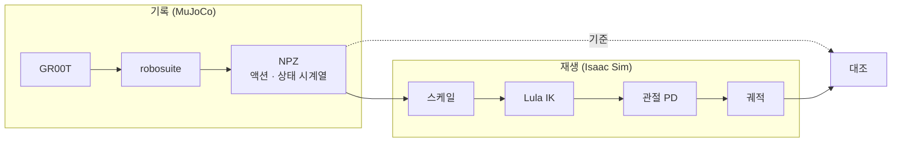

# 캘리브레이션

어댑터의 스케일 값을 정하는 절차다. 성공률을 보지 않고 정한다.

---

## 1. 폐루프 조정이 실패하는 이유

성공률을 보고 파라미터를 바꾸는 방식으로는 `PSCALE`이 세 번 바뀌었고 매번 다른 근거가 붙었다.

| 시점 | 값 | 근거 | 실제 |
|---|---|---|---|
| 초기 | 0.016 | 도달률 0.57 가정 | 참조의 66% |
| 중간 | 0.020 | 폐루프 게인 실측 0.33 | 참조의 81% |
| 후기 | 0.031 | 질의 1~9 평균 이동비 | 참조의 128% |

**자기참조가 원인이다.** 실효 전달률은 `PSCALE × 도달률`인데, 도달률 자체가 `PSCALE`의 함수다.

| PSCALE | 측정된 도달률 |
|---|---|
| 0.016 | 0.383 |
| 0.020 | 0.497 |
| 0.0275 | 0.687 |

명령이 크면 팔이 정상 속도 구간에 들어가 도달률이 올라간다. 즉 전달률은 `PSCALE`에 선형이 아니라 대략 제곱에 비례한다. 여기에 폐루프에서는 정책 분산과 관측 오차가 겹친다.

---

## 2. 개루프 재생

참조가 MuJoCo에서 낸 액션을 기록해 **정책을 호출하지 않고** 어댑터에 그대로 투입한다.



정책과 관측이 빠지므로 남는 변수는 어댑터 변환뿐이다. 같은 액션·같은 초기 상태이므로 결과가 결정론적이다.

> 이 재생은 **계측 전용**이다. 재생으로 얻은 궤적은 성능 지표로 쓰지 않는다. 기록 스크립트에도 그 제한이 명시되어 있다.

---

## 3. 첫 질의만 사용한다

질의별 이동비(`PSCALE=0.031`)를 보면 값이 일정하지 않다.

| 질의 | q1 | q2 | q3 | q4 | q5 | q6 | q7 |
|---|---|---|---|---|---|---|---|
| 이동비 | 1.32 | 1.06 | 0.90 | 1.01 | 0.95 | 0.69 | 1.12 |

q0에서는 이식과 참조의 자세가 11 mm 이내로 같다. q3 이후는 궤적이 벌어져 **자코비안이 달라지므로** 같은 액션이라도 결과가 다르다. 오염된 값이다.

**q0 → q1 한 질의만 쓴다.** 이 구간은 초기 자세가 같아 비교가 성립한다.

---

## 4. 측정 결과

### 4-1. 전체 스케일

에피소드 4개, 각 1회 재생. 누적이 없으므로 산포가 거의 없다.

| PSCALE | ep0 | ep1 | ep2 | ep3 | 평균 |
|---|---|---|---|---|---|
| 0.020 | 0.801 | 0.796 | 0.820 | 0.808 | **0.806** |
| 0.024 | 0.971 | 0.966 | 0.999 | 0.979 | **0.979** |
| 0.028 | 1.141 | 1.136 | 1.177 | 1.149 | **1.151** |
| 0.031 | 1.269 | 1.262 | 1.309 | 1.278 | **1.279** |

소수점 셋째 자리까지 일치한다. 선형 보간으로 **이동비 1.00은 `PSCALE = 0.0245`**다.


### 4-2. 축별 잔차

전체 스케일을 맞춘 뒤 축별로 다시 본다.

| 조건 | x | y | z |
|---|---|---|---|
| `PSCALE=0.0245`, 보정 없음 | 1.10 | 0.87 | 1.41 |
| `+ PYSC=1.18` | 1.10 | 1.03 | 1.41 |
| `+ ZFF=0.0008` | 1.10 | 1.03 | 1.19 |
| `+ ZFF=0.0003` | 1.10 | 1.03 | 0.88 |
| `+ PXSC=0.91, ZFF=0.0003` | **0.99** | **1.03** | **0.99** |

세 축 모두 1.00 ± 0.03에 들어온다. 4개 에피소드에서 0.995 ~ 1.037이다.

### 4-3. 축별 차이의 원인

Franka Panda의 관절 배치와 중력 방향 때문이다.

| 관절 | 최대 토크 | 주도 축 |
|---|---|---|
| 1 (베이스 요) | 87 N·m | y |
| 2, 4 (어깨·팔꿈치) | 87 N·m | x, z |
| 5, 6, 7 (손목) | 12 N·m | 자세 |

y는 베이스 요 회전이 주도하고 중력 토크를 거의 받지 않는다. x·z는 어깨·팔꿈치가 주도하며 중력 부하가 자세에 따라 변한다. 관절 위치 PD에는 중력 보상이 없으므로 정상 편차가 축마다 다르게 남는다.

### 4-4. z 전향 보상의 재해석

`ZFF`는 중력 처짐을 상쇄하는 상수다.

| 상태 | ZFF | 의미 |
|---|---|---|
| 스케일 정합 전 (`PSCALE=0.016`) | 0.0029 | 질의당 +23 mm |
| 스케일 정합 후 (`PSCALE=0.0245`) | 0.0003 | 질의당 +2.4 mm |

**10분의 1로 줄었다.** 이전에 "중력 처짐"으로 해석했던 양의 대부분은 사실 스케일 부족이었다. 명령이 절반이면 z도 절반만 가고, 그것을 처짐으로 오인해 큰 상수로 메우고 있었다.

이 상수는 접근 구간에도 상시 적용된다(`ZFFALL=1`). 파지 후에만 적용하는 방식은 하강이 빨라져 파지 정확도가 나빠졌다.

---

## 5. 정합하지 못한 계층

### 5-1. 회전

지표가 성립하지 않는다. 상태의 자세 성분이 축각 표현이고 roll이 π 근처라, 작은 회전을 더해도 표현이 퇴화한다.

```
aa(δ · R) ≠ aa(R) + δ        (R의 roll ≈ π 부근)
```

이동비를 계산하면 roll·pitch가 `nan`이 되고 yaw는 음수가 나온다. 쿼터니언 각도 기반으로 지표를 다시 만들어야 한다.

### 5-2. 그리퍼

손가락 거동이 접촉 의존이라 개루프로 분리할 수 없다.

| 상황 | 손가락 최종 위치 |
|---|---|
| 그릇에 닿음 | 0.0137 ~ 0.0160 (물체가 멈춤) |
| 허공에서 폐쇄 | −0.0001 (목표를 지나침) |

목표값 `GCLOSE`를 0.000 → 0.006으로 바꿔도 결과가 거의 변하지 않는다. 접촉이 있으면 물체가, 없으면 위치 제어의 오버슛이 결과를 정한다.

참조와의 차이는 확인했다. 참조는 손가락이 2~8 mm에서 멈추고 이식은 0 mm까지 조인다. 참조는 힘 제어, 이식은 위치 제어다. 구조적 차이이며 스케일로 흡수할 수 없다.

---

## 6. 재현

```bash
# 참조 액션 기록 (MuJoCo, Isaac Sim 불필요)
ENVN="libero_sim/<task_env_name>" NEP=10 PORT=<policy_port> \
  python bm/record_npz.py

# 개루프 재생 (정책 서버 불필요)
REPLAY=<npz_path> REPEP=<episode> MAXSTEPS=3 \
  PSCALE=<value> PXSC=<value> PYSC=<value> ZFF=<value> \
  python run_groot_libero.py
```

로그의 `[RPL]` 줄이 질의별 참조 위치와 이식 위치를 함께 출력한다. q0 → q1 변위의 비가 이동비다.
