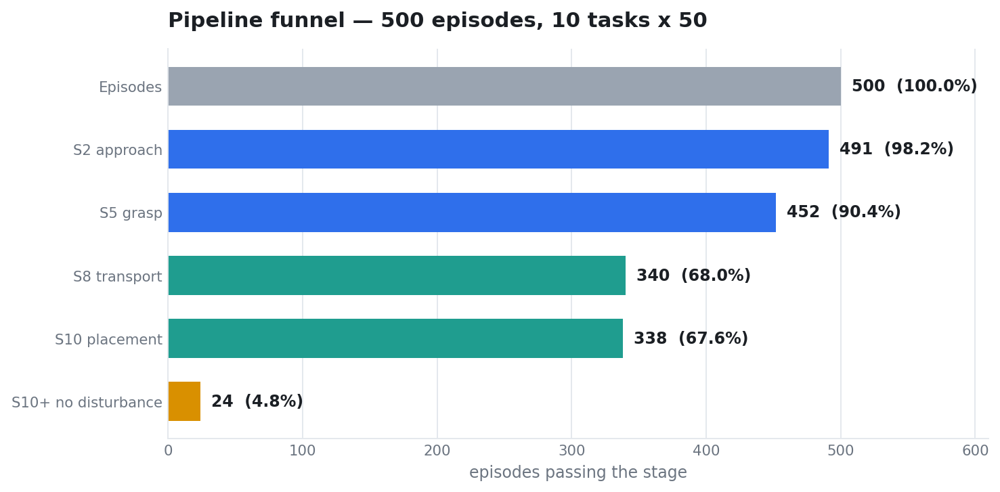
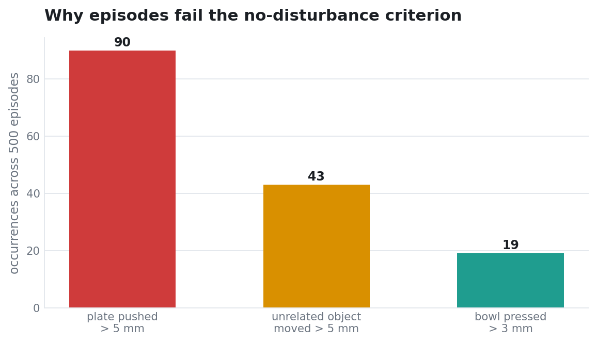
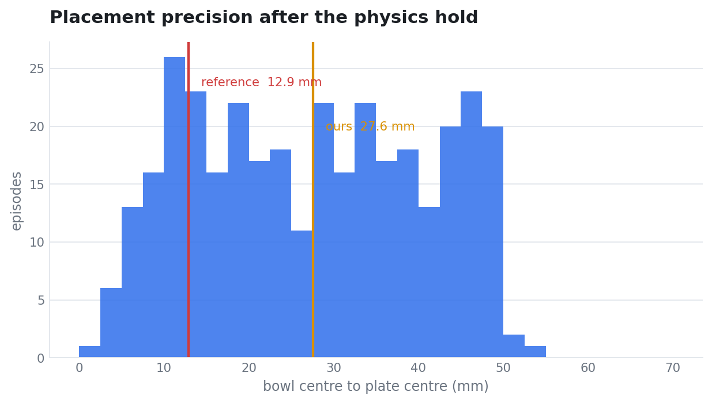
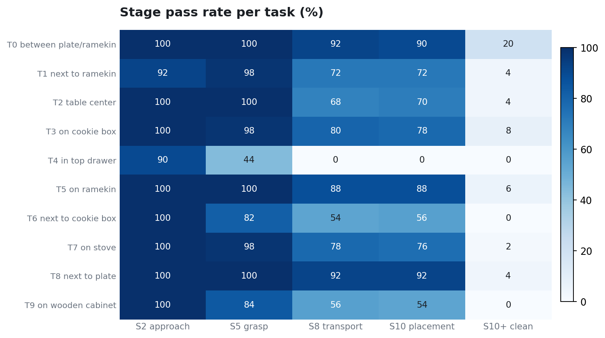

# 실패 분석

500 에피소드에서 무엇이 어디서 무너지는가.

---

## 1. 전체 구도

| 구간 | 손실 | 비율 |
|---|---|---|
| 접근 → 파지 | 39 | 7.8% |
| 파지 → 이송 | 112 | 22.4% |
| 이송 → 배치 | 2 | 0.4% |
| 배치 → 무교란 | 314 | 62.8% |

두 개의 병목이 있다. **파지 후 이송**과 **교란 없는 마무리**다. 성격이 완전히 다르다.

---

## 2. 파지는 병목이 아니다

500 에피소드 중 491판에서 그리퍼가 닫히고, 452판에서 그릇이 실제로 들린다.

이는 이 작업의 출발점과 대비된다. 동일 벤치마크의 선행 이식 보고에서는 정책 종류와 무관하게 파지가 성립하지 않았다. 이 저장소의 결과는 **파지 실패가 정책의 한계가 아니라 행동 공간 규약의 불일치**였음을 보인다.

파지 자세를 참조와 대조하면 다음과 같다.

| 항목 | 참조 | 이식 |
|---|---|---|
| 그리퍼–그릇 x 오차 (중앙) | 0.000 m | −0.020 m |
| 그리퍼–그릇 y 오차 (중앙) | −0.048 m | +0.019 m |
| 거리 (중앙) | 0.043 ~ 0.062 m | 0.050 m |
| 파지 질의 번호 | q5 ~ q6 | q6 ~ q7 |

y 오차의 부호가 반대인 것은 그릇이 그리퍼 개방폭(80 mm)보다 크기 때문이다. 그릇 지름이 112 mm라 **테두리를 무는 파지만 가능**하고, 어느 쪽 테두리를 무느냐에 따라 그릇 중심이 그리퍼 기준 반대편에 놓인다.

---

## 3. 무교란 기준 실패

| 사유 | 발생 | 문턱 | 참조 실측 |
|---|---|---|---|
| 접시 밀림 | 90 | 5 mm | 0.2 mm |
| 무관 물체 이동 | 43 | 5 mm | 0.0 mm |
| 그릇 눌림 | 19 | 3 mm | 0.0 mm |

**접시 밀림이 지배적이다.** 원인은 배치 정밀도다.

| | 중앙값 |
|---|---|
| 참조 | 12.9 mm |
| 이식 | 27.6 mm |

그릇을 접시 중심에서 27 mm 떨어진 곳에 놓으면, 그릇 테두리가 접시 테두리에 얹히면서 접시를 민다. 참조는 13 mm에 놓으므로 접시가 0.2 mm만 움직인다.

**정밀도 부족이 그대로 교란으로 전환된다.** 이것이 배치 성공 67.6%와 무교란 성공 4.8% 사이의 격차 대부분을 설명한다.

---

## 4. 태스크별 유형

### 4-1. T4 서랍 — 이송 실패

| 지표 | 값 |
|---|---|
| 그리퍼 폐쇄 | 45 / 50 |
| 들어올림 | 22 / 50 |
| 접시 도달 | **0 / 50** |
| 들어올린 판의 최종 거리 (중앙) | 458 mm |
| 파지 후 미끄러짐 (중앙) | 0.411 m |
| 에피소드 길이 (중앙) | 350질의 (상한 소진) |

그릇을 서랍에서 꺼내는 데까지는 성공한다. 최선의 판은 그릇을 테이블 높이(0.900)까지 내렸으나 접시가 아닌 위치였다.

서랍 안에서 그릇을 무는 자세는 열린 공간과 다르다. 미끄러짐 중앙값 0.411 m는 그릇이 그리퍼 안에서 크게 재배치됐다는 뜻이다. 참조는 같은 태스크를 14~17질의로 완결한다.

씬 측 문제도 함께 있다. [씬 충실도](scene_fidelity.md) 참조.

### 4-2. T6, T9 — 들어올리기 실패

| | T6 성공 | T6 실패 | T9 성공 | T9 실패 |
|---|---|---|---|---|
| 최대 상승량 (중앙) | 0.059 | **0.021** | 0.094 | **0.061** |
| 미끄러짐 (중앙) | 0.087 | **0.375** | 0.123 | **0.344** |
| 에피소드 길이 (중앙) | 38 | 250 | 33 | 250 |

성공과 실패가 **미끄러짐**으로 갈린다. 실패 판은 그릇이 그리퍼 안에서 4배 크게 움직인다. 한 번 놓치면 재시도가 반복되고 상한까지 간다.

두 태스크의 공통점은 그릇의 방위각이 다른 태스크와 크게 다르다는 것이다. T6의 그릇은 로봇 기준 앞쪽(`y < 0`), 대부분의 태스크는 뒤쪽(`y > 0`)이다. 접근 자세가 달라지고, 회전 누적기가 상한(`RMAX`)에 붙는다.

다만 회전 누적값은 성공·실패 판이 모두 상한 0.5000으로 동일해 **판별 변수가 되지 못한다.** 회전이 원인이라는 근거는 아직 없다.

### 4-3. T2 — 정밀도

| 지표 | 값 |
|---|---|
| 들어올림 | 50 / 50 |
| 배치 (< 50 mm) | 35 / 50 |
| < 30 mm | **2 / 50** |
| < 20 mm | **0 / 50** |

파지는 완벽한데 배치가 접시 가장자리에 몰린다. 그릇 시작 위치가 테이블 중앙이라 접시까지의 이송 벡터가 다른 태스크와 다르다.

---

## 5. 놓은 뒤의 거동

학습 데이터에 배치 이후 구간이 없으므로 이 국면의 행동은 분포 밖이다.

| 항목 | 값 |
|---|---|
| 배치 성공 | 338 |
| 그리퍼가 물러남 | 46 |
| 놓은 뒤 다시 집음 | 186판, 평균 1.2회 |
| 물리 검증 탈락 | 32 |

정책이 스스로 물러나는 경우가 있다(46판). 스크립트 개입 없이 정책 출력만으로 그리퍼가 그릇에서 100 mm 이상 떨어진다. 놓은 직후의 화면이 접근 시작 국면과 닮아 후퇴 동작이 나오는 것으로 보이나, 확인된 것은 아니다.

재파지가 더 흔하다. 이는 정책 결함이 아니라 **에피소드를 끝내지 않은 결과**다. 참조 환경은 성공 순간 종료하므로 이 국면 자체가 존재하지 않는다.

---

## 6. 확인되지 않은 것

| 항목 | 상태 |
|---|---|
| T6·T9의 접근 자세 차이가 미끄러짐을 만드는가 | 상관만 관측. 인과 미확인 |
| 회전 누적 포화가 성능에 영향을 주는가 | 성공·실패 판이 동일 값. 판별 불가 |
| 손목 카메라의 잔여 불일치(액션 거리 0.14 대 0.06)의 정체 | 방향·거리·화각은 검증됨. 렌더링 차이 가능성 |
| 배치 정밀도 27.6 mm의 직접 원인 | 미규명 |

---

## 7. 기각된 원인 가설

성능 저하의 원인으로 검토했다가 데이터로 배제한 항목이다. 상세는 [기각 기록](rejected.md)에 있다.

| 가설 | 기각 근거 |
|---|---|
| 회전 누적기 포화 | 성공·실패 판이 모두 상한. 에피소드 길이로 매개된 허위 상관 |
| 에피소드 길이 | 짧은 판에도 실패, 긴 판에도 성공 |
| 관절 게인 부족 | 강성 3배에도 후퇴 드리프트 −1.98 대 −2.05 mm/질의로 불변 |
| 정책 샘플링 분산 | 동일 관측 반복 질의의 착지 산포 1.8 ~ 2.8 mm. 관측된 차이의 1/10 |
| 하강 타이밍 | 성공 판의 하강 여유가 −3 ~ +19 mm로 산포. 패턴 없음 |
| 손목 시야 상실 | 위치 오차보다 예측력이 낮음 |
| 청크 길이 | `NSUB=4`에서 악화 |
| 궤적 분산 | 분산을 절반으로 줄여도 파지 품질 불변 |
