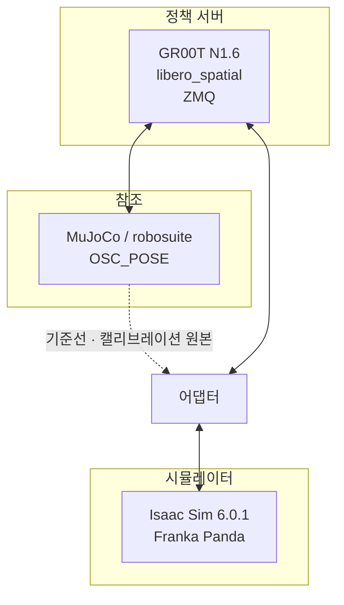

# 측정 방법

실행 조건과 절차의 전량이다.

---

## 1. 구성



정책 서버는 두 환경이 공유한다. 동일 가중치·동일 embodiment tag다.

---

## 2. 환경

| 항목 | 값 |
|---|---|
| 시뮬레이터 | NVIDIA Isaac Sim 6.0.1 |
| 물리 | PhysX, 60 Hz |
| 로봇 | Franka Emika Panda |
| 관절 제어 | 위치 PD, kp 22918, kd 4583 (에셋 기본값) |
| 관절 최대 토크 | 87 / 87 / 87 / 87 / 12 / 12 / 12 N·m |
| 역기구학 | Lula, 4단계 폴백 |
| 정책 | GR00T N1.6, `libero_spatial` 체크포인트 |
| embodiment tag | `libero_sim` |
| 참조 | MuJoCo / robosuite, OSC_POSE, `n_action_steps = 8` |

관절 게인은 로봇 에셋의 기본값이며, 이 작업에서 설정한 값이 아니다.

---

## 3. 관측

| 채널 | 해상도 | 화각 | 위치 |
|---|---|---|---|
| 3인칭 | 256×256 | fovy 45° | `[0.65861, 0, 1.61035]` |
| 손목 | 256×256 | 75° | hand 프레임 `[0.05, 0, 0]` |

3인칭 카메라 설정은 실행 로그의 유효 좌표로 확인한다. 설정 파일에 카메라 블록과 프로파일 블록이 모두 있고 프로파일이 우선하므로, 파일 값이 아니라 로그 값이 실제다.

---

## 4. 실행 조건

### 4-1. 확정 파라미터

```
# 스케일 — 개루프 NPZ 재생으로 유도
PSCALE=0.0245  PXSC=0.91  PYSC=1.18  ZFF=0.0003  ZFFALL=1  PSCALE2=0

# 관측 — 참조 이미지 대조 및 정책 프로브로 검증
FLIP=n  WRIST=real  WFLIP=h  WROLL=180  WFOV=75
WX=0.05  WY=0  WZ=0  WRX=0  WRY=-90  WRZ=0  WWARM=16

# 상태 — 참조 실측
GINIT=0.0208  GSIGN=1  QROT=z180  EEFRAME=right_gripper  GRIPOFF=0.0

# 제어 주기 — 참조와 동일
SUBSTEP=3  NSUB=8  KSAMP=1

# 회전 — 미검증, 기존 값 승계
RSCALE=0.5  RMAX=0.5  RBASE=acc  ROTOFF=0

# 그리퍼 — 설계 선택
GCHUNK=1  NOREOPEN=0  GOPEN=0.04  GCLOSE=0.0  GZFRAC=0.8  NEEDGRASP=1

# 판정 — 물리 측정 및 참조 실측
PSEAT=0.0130  REFR=0.050  REFZTOL=0.006  REFOPEN=0.008  REFSTILL=1
SETTLEQ=60  TERMREF=1  TERMHOLD=1  HOLDQ=5  RETWAIT=10
MAXPMOVE=0.005  MAXDIST=0.005  MAXBPEN=0.003  MAXBIMP=12
OKLIFT=0.017  OKBZ=0.908  OKZMAX=0.930  OKSTILL=10

# 씬
FLOORZ=0.90  PACC=0  HOLD=0
```

### 4-2. 태스크별 상한

에피소드 길이 상한은 참조가 필요로 하는 질의 수에 여유를 곱해 정했다.

| 태스크 | 참조 질의 | 상한 |
|---|---|---|
| T0, T1, T2, T3, T5, T8 | 9 ~ 11 | 150 |
| T6, T9 | 11 ~ 29 | 250 |
| T4, T7 | 12 ~ 27 | 350 |

### 4-3. 표본

| 항목 | 값 |
|---|---|
| 태스크 | 10 |
| 태스크당 에피소드 | 50 |
| 총 에피소드 | 500 |
| 참조 태스크당 에피소드 | 10 |
| 참조 총 | 100 |

---

## 5. 표본 크기에 관한 주의

조건당 6판 또는 12판으로는 판정이 흔들린다. 실제로 관측한 사례다.

| 조건 | 6판 | 12판 |
|---|---|---|
| T6 배치 성공 | 5/6 (83%) | **4/12 (33%)** |
| 동일 설정 반복 (T0) | 1/6 vs 4/6 | — |

**동일 파라미터·동일 코드에서 1/6과 4/6이 나온다.** 파라미터를 확정하는 A/B는 최소 24판이 필요하다.

이 저장소의 최종 측정은 태스크당 50판이다.

---

## 6. 절차

### 6-1. 참조 기준선

```bash
ENVN="libero_sim/<task_env_name>" NEP=10 PORT=<policy_port> \
  python bm/record_npz.py
```

Isaac Sim을 띄우지 않는다. MuJoCo 환경만 실행하며 태스크당 약 90초다.

액션·상태 시계열을 NPZ로 저장한다. 이 데이터는 **캘리브레이션과 기준선 산출에만** 쓰며, 이식 환경에서 재생해 성공을 만드는 용도로는 쓰지 않는다.

### 6-2. 개루프 캘리브레이션

```bash
REPLAY=<npz_path> REPEP=<episode> MAXSTEPS=3 \
  PSCALE=<value> PXSC=<value> PYSC=<value> ZFF=<value> \
  python run_groot_libero.py
```

정책 서버를 부르지 않는다. 판당 3질의로 끝난다. 상세는 [캘리브레이션](calibration.md).

### 6-3. 본 측정

```bash
TASK=<0..9> MAXSTEPS=<limit> <확정 파라미터> \
  python run_groot_libero.py
```

두 GPU 레인에서 병렬 실행한다. 각 레인은 별도 포트의 정책 서버를 쓴다.

두 서버가 동일한지는 동일 입력에 대한 출력으로 확인했다.

| 시점 | 서버 A | 서버 B |
|---|---|---|
| 하강 직전 | −0.123 ± 0.011 | −0.151 ± 0.024 |
| 하강 중 | −0.311 ± 0.036 | −0.301 ± 0.024 |
| 하강 후 | −0.258 ± 0.043 | −0.258 ± 0.036 |

각자의 샘플링 산포 안에서 일치한다.

### 6-4. 집계

```bash
python scripts/mkcsv.py          # 로그 → data/episodes.csv
python scripts/plot.py           # CSV → assets/*.png
```

---

## 7. 실행 중 주의 사항

측정을 무효화한 적이 있는 항목이다.

| 항목 | 증상 | 대응 |
|---|---|---|
| 병렬 레인의 설정 파일 공유 | 첫 판이 YAML 파싱 오류로 유실 | 레인별 파일명 분리 |
| 실행 스크립트의 고정 환경변수 | 조건 문자열에서 누락한 값이 조용히 다른 값으로 실행 | 확정값으로 갱신, 조건 문자열에 전량 명시 |
| 카메라 프로파일 우선순위 | 설정 파일 값이 아니라 프로파일 값이 적용 | 실행 로그의 유효 좌표를 진실로 삼음 |

병렬 실행 시 **같은 조건을 두 레인에 나눠 배치**한다. 조건별로 레인을 고정하면 레인 차이가 조건 차이로 오독될 수 있다.

---

## 8. 데이터 형식

`data/episodes.csv`는 에피소드당 1행, 41개 필드다.

| 그룹 | 필드 |
|---|---|
| 식별 | `task`, `episode` |
| 파지 | `close_q`, `d_x`, `d_y`, `tip_rim`, `nclose`, `slip`, `ltilt` |
| 들기 | `maxlift`, `peaklift`, `bpush` |
| 이송·배치 | `dPlate`, `bowlz`, `refok`, `holdd`, `holdz`, `hold_drift` |
| 교란 | `pmove`, `pmax`, `distmax`, `distobj`, `bpen`, `bimp`, `bzmin` |
| 판정 | `termhold`, `strict`, `strict_why`, `ok013`, `ok020`, `ok030`, `ok050` |
| 종료 | `steps`, `retq`, `lost_n`, `reject_n` |
| 제어 | `ikfail`, `rotacc` |
