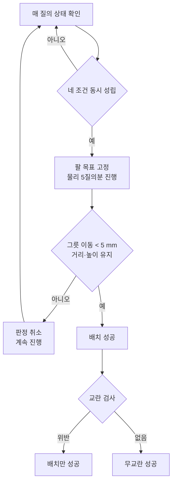

# 성공 판정

무엇을 성공으로 셀지가 결과를 만든다. 이 문서는 판정의 정의와 각 문턱이 어디서 나왔는지를 기록한다.

---

## 1. 왜 판정을 새로 만들어야 했나

참조 환경은 BDDL 술어가 성립하는 순간 에피소드를 종료한다.

| 항목 | 참조 실측 |
|---|---|
| 에피소드 길이 | 74 ~ 138 env-step (질의 10 ~ 17회) |
| 884 스텝 중 성공 판정이 참인 스텝 | 10 (에피소드당 1) |

즉 **시연 데이터의 마지막 프레임이 "놓는 동작"이다.** 놓은 뒤의 구간이 학습 데이터에 존재하지 않는다.

정책에는 보상도, 종료 신호도, 성공 여부도 들어가지 않는다. 배치가 끝난 상태는 정책이 본 적 없는 관측이고, 실제로 다시 집으려는 행동이 나온다(500판 중 186판).

이식 환경에는 BDDL 술어가 없다. 판정과 종료를 어댑터가 담당해야 한다.

---

## 2. 단계 정의

교수 지도의 S1–S10 단계 구분을 따르되, 이식 환경에서 측정 가능한 항목만 사용한다.

| 단계 | 내용 | 측정 | 지표 |
|---|---|---|---|
| S1 | 공간 지시 기반 목표 선택 | **불가** | 씬에 검은 그릇이 1개뿐 |
| S2 | 목표 접근 | 가능 | 파지 시도 발생 여부 |
| S3 | Pre-grasp 정렬 | 부분 | 위치 오차만. 회전 오차 미계측 |
| S4 | 그리퍼 삽입·양측 접촉 | **불가** | 접촉 센서 미구성 |
| S5 | 폐쇄·안정 파지 | 가능 | 들어올림 성공, 파지 후 미끄러짐 |
| S6 | 들어올리기 | 가능 | 최대 상승량 |
| S7 | 안전 이탈 | 부분 | 최종 이동량만. 충돌 순간 미기록 |
| S8 | 접시까지 이송 | 가능 | 접시 반경 도달, 재파지 횟수 |
| S9 | 위 정렬·하강 | 부분 | 배치 오차, 충격 횟수. 기울기 미계측 |
| S10 | 해제·최종 안정화 | 가능 | 물리 검증 통과, 2초 이동량 |

측정 가능한 5개 지점으로 funnel을 구성한다.

---

## 3. 판정 절차

**네 조건**

| 조건 | 문턱 |
|---|---|
| 그릇 중심이 접시 중심에서 | < 50 mm |
| 그릇 높이가 안착 높이에서 | ± 6 mm |
| 손가락이 열려 있음 | > 8 mm |
| 직전 질의 대비 그릇 이동 | < 3 mm |

**물리 검증**이 핵심이다. 조건이 성립하면 팔을 그 자리에 고정하고 물리만 2초 진행한다. 그릇이 제대로 얹혔으면 그대로 있고, 매달려 있었거나 기울어 있었으면 떨어진다. 500 에피소드 중 32판이 여기서 탈락했다.

---

## 4. 문턱의 근거

임의로 정한 값을 결과에 맞춰 조정하지 않기 위해, 각 문턱을 물리 측정 또는 참조 실측에서 유도했다.

### 4-1. 안착 높이 — 물리 측정

그릇을 접시 중심 위 100 mm에서 낙하시켜 180 스텝 정착시켰다.

| 태스크 | 접시 원점 z | 정착 후 그릇 z | 차이 |
|---|---|---|---|
| T0 | 0.8989 | 0.9119 | +0.0130 |
| T2 | 0.8989 | 0.9119 | +0.0130 |
| T5 | 0.8989 | 0.9119 | +0.0130 |
| T8 | 0.8989 | 0.9119 | +0.0130 |

접시 기하가 정하는 값이며 성공률과 무관하다. **`PSEAT = 0.0130`**.

참조 실측값(+0.0084)을 그대로 쓰면 안 된다. 참조 접시와 이식 접시의 오목부 깊이가 다르다. 실제로 참조 값을 적용했을 때 배치 성공률이 83/120에서 47/120으로 떨어졌다.

### 4-2. 배치 반경 — 물리 측정

그릇을 접시 중심에서 오프셋을 두고 낙하시켜, 안착 높이와 기울기가 유지되는 한계를 찾았다.

| 오프셋 | 정착 후 거리 | 높이 | 기울기 | 판정 |
|---|---|---|---|---|
| 0 mm | 1.5 mm | +0.0130 | 0.6° | 안착 |
| 10 mm | 9.4 mm | +0.0131 | 0.6° | 안착 |
| 20 mm | 19.3 mm | +0.0132 | 0.5° | 안착 |
| 30 mm | 29.8 mm | +0.0132 | 0.3° | 안착 |
| 40 mm | 39.8 mm | +0.0132 | 0.3° | 안착 |
| 50 mm | 50.5 mm | +0.0132 | 0.4° | 안착 |
| 60 mm | 67.5 mm | 흔들림 | — | 미끄러짐 |

**50 mm까지 기울기 1° 미만으로 평평하게 얹힌다.** `REFR = 0.050`.

기하학적으로 계산한 값(접시 반경 68.7 mm − 그릇 반경 56.0 mm = 12.7 mm)은 참조 실측 12.9 mm와 일치한다. 이 값은 "그릇 밑면 전체가 접시 안"이라는 더 엄격한 기준에 해당한다.

**두 기준을 모두 보고한다.** 6절의 문턱별 성공률 표가 그것이다.

### 4-3. 교란 문턱 — 참조 실측

참조 롤아웃에서 성공 시점까지의 물체 이동량을 측정했다. 리셋 직후 낙하분을 제외하기 위해 정착 5스텝 이후를 기준으로 삼았다.

| 항목 | 참조 실측 | 채택 문턱 |
|---|---|---|
| 접시 이동 | 0.2 mm | 5 mm |
| 방해 그릇 이동 | 0.0 mm | 5 mm |
| 쿠키 상자 이동 | 0.0 mm | 5 mm |
| 라메킨 이동 | 0.0 mm | 5 mm |
| 그릇 침하 | 0.0 mm | 3 mm |
| 그릇 z 급락 3 mm+ 횟수 | 10 | 12 |

참조는 목표 그릇 외에 **아무것도 건드리지 않는다.** 문턱은 참조 실측에 물리 잡음 마진을 더한 값이다.

### 4-4. 기준 좌표의 정착

물체는 리셋 직후 공중에서 스폰되어 낙하한다.

| 시점 | 접시 z |
|---|---|
| 리셋 직후 | 0.9700 |
| 정착 후 | 0.9022 |

기준 좌표를 리셋 직후에 읽으면 로봇이 건드리지 않아도 4.3 mm 이동한 것으로 기록된다. 실제로 그릇을 한 번도 놓지 않은 에피소드에서 접시 이동 4.3 mm가 관측되었다.

**60 스텝 정착 후에 기준을 읽는다**(`SETTLEQ=60`). 이 처리를 넣자 접시 이동 최솟값이 4.2 mm에서 1.2 mm로 내려갔다.

---

## 5. 설계 선택으로 남은 값

물리 유도가 아닌 값이다. 결과에 영향을 주므로 명시한다.

| 값 | 설정 | 성격 |
|---|---|---|
| 안착 높이 허용치 | ± 6 mm | 물리 측정 산포보다 넓게 잡은 여유 |
| 손가락 개방 판정 | > 8 mm | 초기값 20.8 mm의 약 40% |
| 정지 판정 | 1질의, 3 mm | 짧게 잡으면 과도구간을 통과시키고, 길게 잡으면 정상 배치를 놓친다 |
| 물리 검증 길이 | 5질의 (2초) | |
| 후퇴 대기 | 최대 10질의 | 판정 시점 이후의 관측 구간 |

이 중 손가락 개방 판정은 초기에 15 mm로 잡았다가 8 mm로 낮췄다. 손가락이 완전 폐쇄 상태에서 15 mm까지 벌어지는 데 1~2질의가 걸리고, 그 사이에 정지 조건이 깨져 정상 배치를 놓치고 있었다. 조정 후 T0의 결과가 유지되면서 T1·T2가 회복된 것으로 타당성을 확인했다.

---

## 6. 문턱 민감도

배치 반경 하나로 성공률이 크게 움직인다. 단일 값을 고르지 않고 곡선을 보고한다.

| 배치 반경 | 성공 | 비율 | 대응 |
|---|---|---|---|
| < 13 mm | 66 / 500 | 13.2% | 참조 정밀도 · 밑면 전체 접촉 |
| < 20 mm | 123 / 500 | 24.6% | |
| < 30 mm | 191 / 500 | 38.2% | |
| < 50 mm | 340 / 500 | 68.0% | 물리적 안착 한계 |

본문의 "배치 성공 67.6%"는 50 mm 기준에 물리 검증을 통과한 값이다.
