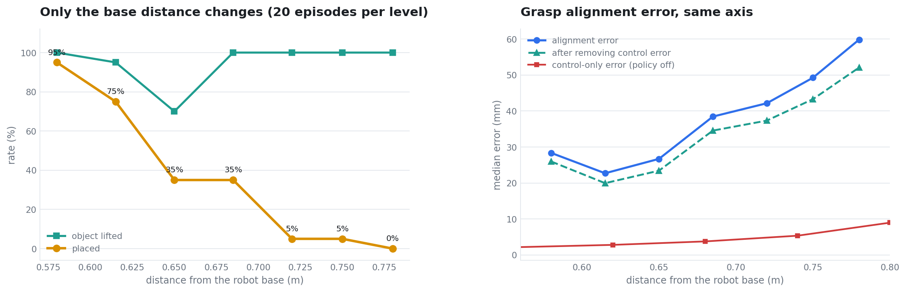

# 작업공간 의존

로봇 베이스로부터의 거리가 파지 정밀도와 성공률을 결정한다. 배치 실험 두 건에서
사후에 발견한 관측을 거리만 바꾸는 실험으로 확인했다.

```
0.58 m 에서 19/20 (95 %)   →   0.78 m 에서 0/20 (0 %)
Pearson  r = −0.956   p = 0.0007
```

---

## 1. 어떻게 나왔나

두 차례의 배치 실험에서 성공을 예측하는 요인이 없었다. 종속변수를 성공이 아니라
**파지 정렬 오차**로 바꾸자 하나가 남았다.

| 상관 대상 | 전체 (n=30) | 이상치 제외 (n=29) |
|---|---|---|
| 로봇 베이스까지 거리 | **+0.609** | **+0.591** |
| 접근 방위각 | +0.486 | +0.085 |
| 학습 배치 거리 | +0.339 | −0.171 |
| 목표 이동량 | +0.407 | −0.178 |
| 경로 여유 | −0.011 | — |

나머지는 이상치 한 세트(정렬 오차 244 mm)에 기대고 있었다.

500판의 태스크 수준에서도 재현된다.

| task | 거리 | 정렬 오차 중앙 |
|---|---|---|
| T7 | 0.414 | 31.9 mm |
| T5 | 0.502 | 51.0 mm |
| T1 | 0.577 | 34.5 mm |
| T2 | 0.585 | 26.8 mm |
| T0 | 0.642 | 67.8 mm |
| T3 | 0.731 | 64.4 mm |
| T6 | 0.735 | 35.4 mm |
| T8 | 0.738 | 64.5 mm |
| T9 | 0.745 | 70.8 mm |
| T4 | 0.769 | 82.7 mm |

```
Pearson   r = +0.650   p = 0.042   (n = 10 태스크)
Spearman  rho = +0.770   p = 0.009
```

**판 수준으로 계산하면 안 된다.** 태스크 안에서 거리가 거의 고정이므로 독립 표본은
10개뿐이다. 판 수준 n=500으로 계산하면 +0.599가 나오지만 자유도가 과대평가된다.

그리고 태스크마다 받침 높이와 주변 물체가 다르다. 거리와 그것들이 섞여 있어
태스크 간 비교로는 거리를 분리할 수 없다. **그래서 확인 실험이 필요했다.**

---

## 2. 확인 실험 설계

학습 배치 순서(접시 – 과자 상자 – 그릇)를 유지한 채 세 물체를 한 덩어리로 옮겼다.
**거리만 변하고 물체 간 거리·순서·방위 관계는 고정된다.**

| 거리 | 그릇 | 과자 상자 | 접시 |
|---|---|---|---|
| 0.580 | [−0.081, −0.030] | [−0.081, +0.120] | [−0.081, +0.300] |
| 0.615 | [−0.046, −0.030] | [−0.046, +0.120] | [−0.046, +0.300] |
| 0.650 | [−0.010, +0.000] | [−0.010, +0.150] | [−0.010, +0.330] |
| 0.685 | [+0.024, +0.030] | [+0.024, +0.180] | [+0.024, +0.360] |
| 0.720 | [+0.058, +0.050] | [+0.058, +0.200] | [+0.058, +0.380] |
| 0.750 | [+0.088, +0.050] | [+0.088, +0.200] | [+0.088, +0.380] |
| 0.780 | [+0.118, +0.050] | [+0.118, +0.200] | [+0.118, +0.380] |

그릇 – 과자 상자 150 mm, 그릇 – 접시 330 mm로 고정했다.
방해 물체는 스토브 위에 고정, 라메킨·스토브·캐비닛은 건드리지 않았다.

### 범위를 0.58 ~ 0.78 로 잡은 이유

```
0.45 이하   스토브와 충돌
0.80 이상   측면 오프셋에서 IK 실패
0.86        전부 IK 실패
```

측면은 y를 고정했다. 측면 오프셋에서 역기구학이 이상 해를 내므로 축이 섞인다.

수준당 20판, 총 140판이다.

---

## 3. 결과



| 거리 | n | 정렬 오차 중앙 | 들기 | 파지 | 도달 | 배치 | 질의 중앙 |
|---|---|---|---|---|---|---|---|
| 0.580 | 20 | 28.4 mm | 20/20 | 20/20 | 19/20 | **19/20 (95 %)** | 32 |
| 0.615 | 20 | 22.7 mm | 19/20 | 19/20 | 15/20 | **15/20 (75 %)** | 36 |
| 0.650 | 20 | 26.7 mm | 14/20 | 11/20 | 7/20 | **7/20 (35 %)** | 250 |
| 0.685 | 20 | 38.5 mm | 20/20 | 15/20 | 7/20 | **7/20 (35 %)** | 250 |
| 0.720 | 20 | 42.2 mm | 20/20 | 18/20 | 2/20 | **1/20 (5 %)** | 250 |
| 0.750 | 20 | 49.2 mm | 20/20 | 18/20 | 1/20 | **1/20 (5 %)** | 250 |
| 0.780 | 20 | 59.8 mm | 20/20 | 13/20 | 0/20 | **0/20 (0 %)** | 250 |

```
거리 ~ 배치 성공률   Pearson −0.956 (p = 0.0007)   Spearman −0.982 (p = 0.0001)
거리 ~ 정렬 오차     Pearson +0.932 (p = 0.0023)   Spearman +0.893 (p = 0.007)

0.58 + 0.615   34/40 (85 %)
0.72 ~ 0.78     2/60 ( 3 %)      Fisher p = 3.5 × 10⁻¹⁸
```

**거리 20 cm 차이로 성공률이 95 %에서 0 %가 된다.**

### 들기는 멀쩡하다

0.685 이상에서 들기는 전부 20/20이다. **멀어도 물체는 든다.** 놓지를 못한다.
조작 능력이 아니라 정밀도 문제다.

질의 수도 0.650부터 상한(250)에 붙는다. 실패 판이 재시도를 반복한다.

---

## 4. 제어 계층의 기여를 분리했다

거리가 멀면 역기구학과 관절 제어의 오차도 커진다. 정책을 호출하지 않고 팔만
21개 지점으로 보내 명령 대비 도달 오차를 쟀다.


| 거리 | 중앙선 오차 | 측면 ±0.12 m |
|---|---|---|
| 0.45 m | 1.41 mm | 1.5 mm |
| 0.55 m | 2.08 mm | 2.2 mm |
| 0.62 m | 2.80 mm | 70.85 mm |
| 0.68 m | 3.76 mm | 34.45 mm |
| 0.74 m | 5.35 mm | 34.53 mm |
| 0.80 m | 8.97 mm | IK 실패 |
| 0.86 m | IK 실패 | IK 실패 |

**역기구학이 성공을 반환하면서 엉뚱한 해를 준다.** 같은 거리에서 중앙선은
2.8 ~ 5.4 mm인데 좌측은 34 ~ 71 mm다. 확인 실험에서 측면을 고정한 이유다.

### 보정 후에도 남는다

```
거리 ~ 정렬 오차          +0.932   (p = 0.0023)
거리 ~ 보정 후 정렬 오차    +0.922   (p = 0.0032)

정렬 오차 변화   31.5 mm
제어 오차 변화    5.4 mm   (17 %)
```

**제어분을 빼도 상관이 거의 그대로다.** 83 %가 정책 쪽이다.

---

## 5. 학습 위치 가설과는 방향이 반대다

"학습한 위치에서 멀어져서 못한다"는 설명이 가능해 보이므로 따로 확인했다.

학습 배치의 그릇 위치는 `[0.130, −0.070]`, 거리 0.793 m다. 확인 실험에서 그릇을
앞으로 당기면 **자동으로 학습 위치에서 멀어진다.**

| 거리 | 학습 배치 거리 (평균) | 그릇 이동량 | 배치 성공 |
|---|---|---|---|
| 0.580 | 188 mm | 215 mm | 19/20 (95 %) |
| 0.615 | 158 mm | 180 mm | 15/20 (75 %) |
| 0.650 | 149 mm | 157 mm | 7/20 (35 %) |
| 0.685 | 156 mm | 146 mm | 7/20 (35 %) |
| 0.720 | 163 mm | 140 mm | 1/20 (5 %) |
| 0.750 | 160 mm | 127 mm | 1/20 (5 %) |
| 0.780 | 162 mm | 121 mm | 0/20 (0 %) |

**학습 위치에 가장 가까운 조건(0.780, 그릇 121 mm)이 전멸하고,
가장 먼 조건(0.580, 그릇 215 mm)이 95 %다.**

```
성공 ~ 거리            −0.956   p = 0.0007
성공 ~ 학습 배치 거리    +0.512   p = 0.24     유의하지 않음
성공 ~ 그릇 이동량       +0.971   p = 0.0003   부호가 +
```

그릇 이동량의 상관이 +0.971이라는 것은 **멀리 옮길수록 잘한다**는 뜻이고,
학습 위치 가설과 정반대다. 그리고 그릇 이동량과 거리의 상관이 −0.958이므로
사실상 같은 축을 반대로 본 것이다.

두 가설이 반대 방향을 가리키고, 데이터는 거리 쪽이다.

> **다만 완전히 분리되지는 않았다.** 확인 실험의 설계상 그릇을 앞으로 당기면
> 자동으로 학습 위치에서 멀어지므로 두 축이 −0.958로 겹친다. 엄밀히 하려면
> 같은 거리에서 학습 위치 대비 거리만 바꾸는 조건이 필요하다. 지금 데이터로
> 말할 수 있는 것은 **"학습 위치에서 멀어져서 못한다"는 설명이 배제된다**는 것이다.

---

## 6. 이전 결과들이 설명된다

### 배치 무작위화 실험

30세트의 거리 범위는 0.658 ~ 0.899 m였다. 확인 실험에서 그 구간은 성공률이
35 % 이하로 무너지는 영역이다. **17 %라는 결과가 여기서 나온다.**

기하학적 난이도와 학습 배치 거리 두 축이 성공을 예측하지 못한 것도 설명된다.
세트를 어떻게 나누든 대부분이 이미 붕괴 구간 안에 있었다.

### T6 단일 사례

```
목표 물체   [0.130, −0.070]  →  [0.074, −0.040]
거리         0.793 m         →   0.735 m      (58 mm 감소)
배치 성공    28/50 (56 %)    →   48/50 (96 %)
```

같은 작업에서 방해 물체 복원과 쿠키 상자 90도 회전도 함께 있었으므로 단독 효과는
아니다. 다만 확인 실험의 곡선 위에 놓인다.

---

## 7. 실물 배치에 주는 값

| 거리 | 배치 성공률 |
|---|---|
| 0.62 m 이하 | 75 % 이상 |
| 0.65 ~ 0.69 m | 35 % |
| 0.72 m 이상 | 5 % 이하 |

물체를 **로봇 베이스에서 0.62 m 안쪽**에 두어야 한다.

---

## 8. 이 실험의 한계

| # | 항목 |
|---|---|
| 1 | 거리와 학습 위치 거리가 −0.958로 겹친다. 완전히 분리되지 않았다 |
| 2 | 측면을 y = 고정으로 두었다. 측면 오프셋에서의 거동은 측정하지 않았다 |
| 3 | 0.80 m 이상은 IK 실패로 측정할 수 없었다 |
| 4 | 태스크 6 한 종류만 썼다. 다른 태스크에서도 같은 곡선인지는 미확인 |
| 5 | 0.650 조건에서 들기가 14/20으로 앞뒤(19~20/20)와 어긋난다 |

5번의 상승량 분포는 이렇다.

```
0.009 0.010 0.010 0.012 0.015 0.016 0.019 0.019 0.022 0.029
0.031 0.034 0.044 0.046 0.052 0.054 0.055 0.066 0.078 0.100
```

문턱 17 mm 근처에 여섯 판이 몰려 있다. 문턱을 조금만 옮겨도 수치가 크게 바뀌는
구간이라 이 한 점은 신뢰하기 어렵다. 성공률 자체는 7/20으로 앞뒤 경향과 맞는다.
