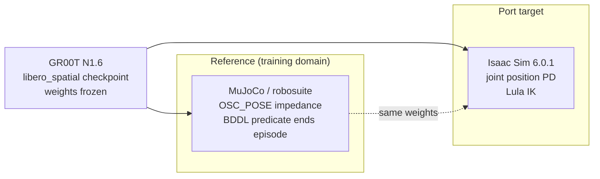
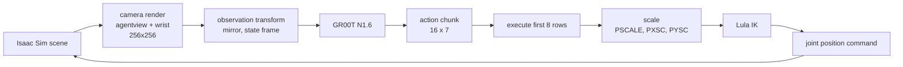
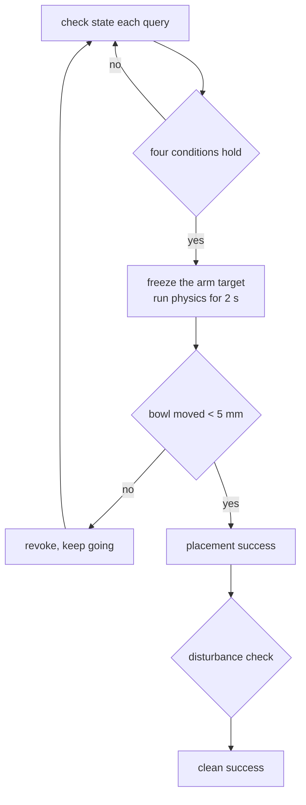

# LIBERO-Spatial Zero-Shot Transfer Benchmark

**GR00T N1.6 · NVIDIA Isaac Sim 6.0.1 · Franka Emika Panda**

A vision-language-action policy trained in MuJoCo, moved to Isaac Sim without retraining.
500 episodes across 10 manipulation tasks.

[Methodology](../docs/methodology.md) ·
[Adapter contract](../docs/adapter.md) ·
[Calibration](../docs/calibration.md) ·
[Success criteria](../docs/success_criteria.md) ·
[Scene fidelity](../docs/scene_fidelity.md) ·
[Failure analysis](../docs/failure_analysis.md) ·
[Rejected hypotheses](../docs/rejected.md) ·
[한국어](../README.md)

---

## Contents

| Section | Topic |
|---|---|
| [1. At a glance](#1-at-a-glance) | Headline results |
| [2. The problem](#2-the-problem) | What was ported and what was not |
| [3. Pipeline](#3-pipeline) | Policy, adapter, simulator |
| [4. Adapter calibration](#4-adapter-calibration) | How the scale was fixed |
| [5. Success criteria](#5-success-criteria) | Stage definitions and threshold provenance |
| [6. Results](#6-results) | Per task, per stage, per threshold |
| [7. Failure analysis](#7-failure-analysis) | Where it breaks |
| [8. Instruction variant](#8-instruction-variant) | Effect of prompt elaboration |
| [9. Raw data](#9-raw-data) | |
| [10. Conditions and limits](#10-conditions-and-limits) | Read before citing |
| [11. Reproduction](#11-reproduction) | |
| [12. Next measurements](#12-next-measurements) | |

---

## 1. At a glance

Same weights, same instructions, no retraining. Only the adapter layer was tuned.

| Stage | MuJoCo reference (n=100) | Isaac Sim (n=500) |
|---|---|---|
| Gripper closes | — | **98.2%** |
| Grasp succeeds (bowl lifted) | — | **90.4%** |
| Placement on plate (2 s physics hold) | 96% | **67.6%** |
| No disturbance to any other object | — | **4.8%** |

The drawer task (T4) has an incomplete scene port. Excluding it: grasp 95.6%, placement **75.1%**.


### Three-line summary

```
1  The action scale was half the reference   — six months of closed-loop tuning missed it
2  Only open-loop replay is reproducible     — feeding reference actions removes policy variance
3  The threshold makes the number            — one threshold moves success from 24.6% to 68.0%
```

### What this repository answers

| Question | Answer |
|---|---|
| Why does a VLA policy collapse when the simulator changes? | Not the policy. The **scale, frame and cadence of the action space** disagree. |
| How do you fix that? | Replay the reference simulator's actions **open loop** and compare trajectories. |
| What remains? | **Placement precision** — 27.6 mm median versus 12.9 mm in the reference. |

---

## 2. The problem



| Item | Reference | Port | Handling |
|---|---|---|---|
| Policy weights | GR00T N1.6 | same | **unchanged** |
| Instruction | LIBERO original | same | **unchanged** |
| Physics | MuJoCo | PhysX | ported |
| Controller | OSC_POSE (impedance) | joint position PD | **absorbed by adapter** |
| IK | robosuite internal | Lula | adapter |
| Observation | robosuite cameras | Isaac RTX | adapter |
| Success test | BDDL predicate | physics verification | rebuilt |

No fine-tuning, no trajectory replay for scoring, no task-specific offsets. The adapter only translates policy output into a different controller's language.

### Tasks

All ten are "pick up the black bowl and place it on the plate". Only the bowl's spatial position differs.

| # | Bowl position | Reference success |
|---|---|---|
| T0 | between plate and ramekin | 8/10 |
| T1 | next to ramekin | 10/10 |
| T2 | table center | 10/10 |
| T3 | on the cookie box | 9/10 |
| T4 | inside the top drawer | 10/10 |
| T5 | on the ramekin | 10/10 |
| T6 | next to the cookie box | 10/10 |
| T7 | on the stove | 10/10 |
| T8 | next to the plate | 10/10 |
| T9 | on the wooden cabinet | 10/10 |

Reference numbers come from running the same policy in MuJoCo, ten episodes per task.

---

## 3. Pipeline



The policy predicts a **16-step trajectory from a single observation**. The adapter executes the first eight rows one at a time, then queries again — the same cadence as the reference's `n_action_steps = 8`.

| Item | Reference | Port |
|---|---|---|
| Actions per query | 8 | 8 |
| Physics per action row | 20 × 0.002 s | 3 × 0.0167 s |
| Fraction of commanded motion achieved | reached within the step | **33 – 50%** |

That last row is the starting point of this work. A joint position PD loop does not reach its target inside one control period. The shortfall has to be absorbed by the scale, and that value was wrong.

---

## 4. Adapter calibration

### Closed-loop tuning does not converge

The effective transfer rate is `PSCALE × reach fraction`, and **the reach fraction is itself a function of `PSCALE`**.

| PSCALE | measured reach fraction |
|---|---|
| 0.016 | 0.383 |
| 0.020 | 0.497 |
| 0.0275 | 0.687 |

Larger commands push the arm into its steady-velocity regime. Transfer is roughly quadratic in `PSCALE`, not linear. Closed loop adds policy variance and observation error on top.

### Open-loop replay

Reference actions recorded in MuJoCo are fed straight into the adapter **without calling the policy**. Policy and observation drop out; only the adapter transform remains.

Only the first query (q0 → q1) is used. Beyond that the trajectories diverge and the Jacobian differs, which contaminates the ratio.


| PSCALE | displacement ratio (ours / reference), 4 episodes |
|---|---|
| 0.016 (previous) | 0.66 |
| 0.020 | 0.806 |
| 0.024 | 0.979 |
| 0.028 | 1.151 |
| 0.031 | 1.279 |

**A ratio of 1.00 corresponds to `PSCALE = 0.0245`.** Four episodes agree to three decimal places. The previous value realised 66% of the reference motion.

### Per-axis residual

| Axis | before | correction | after |
|---|---|---|---|
| x | 1.10 | `PXSC = 0.91` | 0.99 |
| y | 0.87 | `PYSC = 1.18` | 1.03 |
| z | 1.41 | `ZFF = 0.0003` | 0.99 |

The axes differ because of joint layout and gravity. The base yaw joint drives y and carries almost no gravity torque; the shoulder and elbow drive x and z under varying load. A joint position PD loop without gravity compensation leaves a different steady-state error on each.

`ZFF` is the gravity-sag feed-forward. Before the scale was correct it needed 0.0029; afterwards **0.0003**, one tenth. Most of what had been attributed to sag was missing scale.

### Observation contract

The policy was queried directly with the same state and instruction, changing only the images.

| Condition | distance to reference action |
|---|---|
| reference images (baseline) | 0.064 |
| our render, contract fixed | **0.063** |
| wrist camera replaced by a copy of the third-person view | **0.714** |

Faking the wrist camera biases the action strongly in one direction. When that direction happens to point at the target, the result looks good — an artefact this benchmark's early measurements had fallen into.

---

## 5. Success criteria

The reference environment ends the episode the moment its BDDL predicate holds. **The training data therefore contains no frames after placement.** Reference episodes run 74 – 138 env-steps.

The policy receives no reward, no termination signal and no success flag. Once the bowl is down, the observation is outside its training distribution, and re-grasping is the common response (186 of 500 episodes).

Terminating is the environment's job. Here it is done by physics verification.



Thresholds come from physical measurement or from reference telemetry, not from tuning against the result.

| Threshold | Value | Source |
|---|---|---|
| Seating height | plate origin + 13.0 mm | drop the bowl from 100 mm above the plate, measure where it settles. Identical across four tasks |
| Placement radius | 50 mm | sweep the drop offset; the limit where tilt stays under 1° |
| Plate displacement | 5 mm | reference measured 0.2 mm, plus noise margin |
| Other objects | 5 mm | reference measured 0.0 mm |
| Bowl compression | 3 mm | reference measured 0.0 mm |
| Impact count | 12 | reference measured 10 |

Objects fall and settle after reset, so reference coordinates are read **after 60 settling steps**. Without this, the plate registers 4.3 mm of movement in episodes where the robot never touched it.

### Threshold sensitivity


| Placement radius | Accepted | Rate |
|---|---|---|
| < 13 mm (reference precision) | 66 / 500 | 13.2% |
| < 20 mm | 123 / 500 | 24.6% |
| < 30 mm | 191 / 500 | 38.2% |
| < 50 mm (physical seating limit) | 340 / 500 | 68.0% |

The repository reports the whole curve rather than picking one value.

---

## 6. Results


| # | n | Closed | Grasped | Placed | Clean | <13mm | <20mm | <30mm | <50mm | Ref | Queries |
|---|---|---|---|---|---|---|---|---|---|---|---|
| T0 | 50 | 50 | 50 | **45** | 10 | 20 | 34 | 42 | 46 | 8/10 | 18 |
| T1 | 50 | 46 | 49 | 36 | 2 | 9 | 18 | 28 | 36 | 10/10 | 39 |
| T2 | 50 | 50 | 50 | 35 | 2 | 0 | 0 | 2 | 34 | 10/10 | 30 |
| T3 | 50 | 50 | 49 | 39 | 4 | 8 | 14 | 23 | 40 | 9/10 | 31 |
| T4 | 50 | 45 | 22 | **0** | 0 | 0 | 0 | 0 | 0 | 10/10 | 350 |
| T5 | 50 | 50 | 50 | 44 | 3 | 13 | 28 | 35 | 44 | 10/10 | 28 |
| T6 | 50 | 50 | 41 | 28 | 0 | 0 | 0 | 5 | 27 | 10/10 | 96 |
| T7 | 50 | 50 | 49 | 38 | 1 | 9 | 15 | 25 | 39 | 9/10 | 31 |
| T8 | 50 | 50 | 50 | **46** | 2 | 4 | 9 | 24 | 46 | 10/10 | 28 |
| T9 | 50 | 50 | 42 | 27 | 0 | 3 | 5 | 7 | 28 | 10/10 | 106 |
| **Total** | **500** | **491** | **452** | **338** | **24** | 66 | 123 | 191 | 340 | 96/100 | |
| | | 98.2% | 90.4% | 67.6% | 4.8% | 13.2% | 24.6% | 38.2% | 68.0% | 96% | |

`Queries` is the median episode length. The reference finishes in 10 – 17; larger values mean repeated attempts.


### Placement precision


| | Median |
|---|---|
| Reference | 12.9 mm |
| Port | **27.6 mm** |

This factor of two determines the gap between 67.6% placement and 4.8% clean placement.

---

## 7. Failure analysis


| Cause | Occurrences | Threshold | Reference |
|---|---|---|---|
| Plate pushed | 90 | 5 mm | 0.2 mm |
| Unrelated object moved | 43 | 5 mm | 0.0 mm |
| Bowl compressed | 19 | 3 mm | 0.0 mm |

Imprecise placement converts directly into disturbance. A bowl set 27 mm off centre catches the plate rim and pushes it.

| Task | Failure mode | Evidence |
|---|---|---|
| T4 drawer | **transport** | 22/50 lift the bowl out, 0 reach the plate. Median final distance 458 mm |
| T6, T9 | **lift** | success and failure separate by slip: 0.087 vs 0.375 (T6), 0.123 vs 0.344 (T9) |
| T2 | **precision** | 50/50 grasp, but only 2/50 land within 30 mm |

Detail in [failure analysis](../docs/failure_analysis.md).

---

## 8. Instruction variant

An elaborated instruction set was tested against the original on four tasks.

```
original   pick up the black bowl on the cookie box and place it on the plate

variant    Locate the black bowl resting on top of the cookie box.
           Pick up that same bowl, lift it clear of the box,
           and place it fully on the plate.
```

| Task | Original | Variant |
|---|---|---|
| T0 | 8/12 | 7/12 |
| T3 | 6/12 | **2/12** |
| T6 | 1/12 | 1/12 |
| T9 | 5/12 | **2/12** |
| Total | **20/48** | **12/48** |

**All four tasks got worse.** The two tasks where lifting was spelled out explicitly (T3, T9) dropped the most, and the median lift height fell rather than rose (0.062 → 0.047).

Delivery of the instruction was verified in the logs. Training instructions are all single sentences and the policy's language embedding comes from that distribution; extending to two or three sentences appears to blur the conditioning. The benchmark uses the original instructions.

---

## 9. Raw data

| File | Contents |
|---|---|
| [data/episodes.csv](../data/episodes.csv) | 500 episodes, 41 fields per row |
| [results/isaac_groot.md](../results/isaac_groot.md) | per-task aggregates |
| [results/reference_mujoco.md](../results/reference_mujoco.md) | MuJoCo reference telemetry |
| [results/calibration_raw.md](../results/calibration_raw.md) | open-loop measurements |
| [results/prompt_ab.md](../results/prompt_ab.md) | instruction variant |

---

## 10. Conditions and limits

| # | Item | Detail |
|---|---|---|
| 1 | **Scene is not the original LIBERO init state** | Object coordinates are generated from region anchors in the configuration, which the file itself notes. 10 – 90 mm from the reference |
| 2 | **T4 drawer anchor was desynchronised** | The bowl did not follow the opening drawer. Fixed using the drawer's measured world displacement; 88 mm remains in z |
| 3 | **The distractor bowl is absent** | The reference scene has two black bowls and the instruction disambiguates between them. **Target-selection cannot be measured** |
| 4 | **Rotation scale unverified** | The axis-angle state degenerates near roll = π and the ratio metric does not hold |
| 5 | **Gripper not calibrated** | Finger behaviour is contact dependent and cannot be isolated by open-loop replay |
| 6 | **Bilateral contact not instrumented** | Grasp is inferred from lift height instead |
| 7 | **Five devices absent from the reference were added** | Chunk-level gripper binarisation, success termination, physics verification, withdrawal window, per-axis scale. All listed in [adapter contract](../docs/adapter.md) |
| 8 | **Some thresholds are design choices** | Seating tolerance 6 mm, open detection 8 mm, still detection 1 query, hold length 5 queries |
| 9 | **Video is one frame per query** | About 1/24 of real time. Motion looks harsher than it is |
| 10 | **Policy output is stochastic** | Repeated queries on an identical observation land within 1.8 – 2.8 mm, smaller than the differences under study |

---

## 11. Reproduction

| Item | Value |
|---|---|
| Simulator | NVIDIA Isaac Sim 6.0.1 |
| Robot | Franka Emika Panda, joint position PD (kp 22918, kd 4583) |
| IK | Lula, four-stage fallback |
| Policy | GR00T N1.6, `libero_spatial` checkpoint, embodiment tag `libero_sim` |
| Observation | agentview 256×256 fovy 45° · wrist 256×256 fov 75° |
| Reference | MuJoCo / robosuite, OSC_POSE, `n_action_steps = 8` |

```
PSCALE=0.0245  PXSC=0.91  PYSC=1.18  ZFF=0.0003  ZFFALL=1
FLIP=n  WRIST=real  WFLIP=h  WROLL=180  WFOV=75  WX=0.05  WRY=-90
GINIT=0.0208  GSIGN=1  QROT=z180  EEFRAME=right_gripper
SUBSTEP=3  NSUB=8  KSAMP=1
RSCALE=0.5  RMAX=0.5  RBASE=acc
GCHUNK=1  NOREOPEN=0  GOPEN=0.04  GCLOSE=0.0
PSEAT=0.0130  REFR=0.050  SETTLEQ=60  REFZTOL=0.006
MAXPMOVE=0.005  MAXDIST=0.005  MAXBPEN=0.003  MAXBIMP=12
TERMREF=1  TERMHOLD=1  HOLDQ=5  RETWAIT=10  REFSTILL=1  REFOPEN=0.008
```

Regenerate every figure:

```bash
python3 scripts/plot.py --csv data/episodes.csv --out assets
```

**Sample size matters.** Six or twelve episodes per condition is not enough — the same configuration produced 1/6 and 4/6 on repeat runs, and one task went from 5/6 to 4/12. Parameter decisions here used at least 24 episodes; the final measurement uses 50 per task.

---

## 12. Next measurements

- [ ] Restore the distractor bowl and measure target selection
- [ ] Instrument finger contact for bilateral-contact measurement
- [ ] Open-loop calibration of the rotation scale using a quaternion-angle metric
- [ ] Diagnose the T4 drawer-to-plate transport failure
- [ ] Third-person camera only, to isolate the wrist camera's contribution
- [ ] Instruction variant across all ten tasks
- [ ] Close the placement-precision gap: 27.6 mm against the reference 12.9 mm
